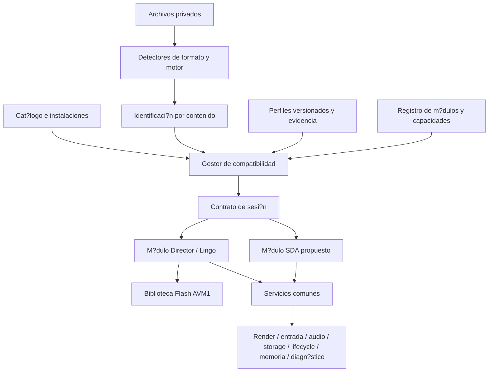

# Arquitectura multijuego de Case-Recomp

> **Auditoría 2026-10-09:** las afirmaciones previas de bonus/desenlace auténticos y campaña completa no están verificadas; existen mecanismos simulados en Kotlin y supuestos en Python. Véase [estado comprobado y pendientes](MYSTERY_PI_ANDROID_AUDIT.md).

Fecha: 2026-10-08. Propuesta de evoluci?n fundada en [auditor?a Huntsville](HUNTSVILLE_COMPATIBILITY_AUDIT.md) y [auditor?a Mystery P.I.](MYSTERY_PI_VEGAS_AUDIT.md). **Especificaci?n, todav?a no implementaci?n.** La investigaci?n previa queda documentada; se conserva el runtime existente sin refactorizar ni borrar m?dulos.

## 1. Decisiones arquitectónicas obligatorias y aprobadas (Requisitos permanentes)

Estas decisiones arquitectónicas son **vinculantes, definitivas e innegociables** para el presente y futuro de Case-Recomp:

### 1.1. Una sola APK multijuego
Case-Recomp se distribuye **exclusivamente como una única aplicación Android (APK)** que reúne todos los motores compatibles que soporte la versión.
- **Prohibición estricta:** No crear una APK para Director, una APK separada para SDA, una APK independiente para Vegas ni empaquetados individuales por juego.
- Los módulos Gradle internos (`:engine`, `:app`) separan capas de compilación, pero se integran siempre en el mismo ejecutable de aplicación final.

### 1.2. Detección automática de juegos y motores
El usuario nunca debe tener que elegir manualmente el motor ni configurar parámetros técnicos.
- El sistema analiza automáticamente los archivos legítimos aportados y reconoce:
  1. La identidad del juego y su edición mediante evidencias verificables (fingerprints, checksums de assets, estructura de ficheros).
  2. El runtime correspondiente (`EngineFamily.DIRECTOR`, `EngineFamily.SDA`).
- Catálogo previsto y mapeo de motores:
  - *Mystery Case Files: Huntsville* -> Director / Lingo (validado).
  - *Mystery Case Files: Prime Suspects* -> Director (sujeto a validación por edición).
  - *Mystery Case Files: Ravenhearst* -> Director / Flash (sujeto a validación).
  - *Mystery P.I.: The Vegas Heist* -> SDA (en desarrollo e integración).
  - *Mystery P.I.: The Lottery Ticket* -> SDA (candidato sujeto a verificación).
- **Regla estricta:** Dos juegos de la misma saga no se presumen compatibles sin verificación individual.

### 1.3. Experiencia de usuario unificada
El flujo de usuario es idéntico e intuitivo para cualquier juego:
1. Obtener legítimamente los archivos originales del juego.
2. Prepararlos con la herramienta de conversión offline cuando sea necesario.
3. Importarlos en Case-Recomp desde la aplicación.
4. Seleccionar el título en el carrusel y pulsar «Jugar».
El usuario no necesita conocer si el juego corre bajo Director, Lingo, SDA, Python o Kotlin.

### 1.4. Motores independientes con servicios compartidos
Director y SDA conservan sus propios intérpretes, parsers, jerarquías de componentes y sistemas de ejecución en paquetes completamente aislados.
- **Prohibición estricta:** No introducir dependencias de Director dentro del runtime SDA ni modificar comportamientos de Huntsville para acomodar Vegas.
- **Servicios Android compartidos:**
  - Superficie y renderizado visual (`StageRenderer`, Viewports, Canvas/Bitmap).
  - Entrada táctil unificada (touch events, escalado lógico, down/up/move/cancel).
  - Audio (SFX, loops, volumen, gestión de canales).
  - Archivos e importación segura (staging, validación, transacciones atómicas).
  - Guardado y persistencia con namespaces estrictamente aislados.
  - Ciclo de vida Android (pause, resume, checkpoints, liberación de memoria).
  - Diagnósticos y registros de ejecución locales.

### 1.5. Aislamiento por juego
Cada juego dispone de identificación, directorio privado de instalación, recursos, perfiles y partidas independientes.
- La importación, ejecución o actualización de Vegas nunca debe alterar, compartir ni sobrescribir los datos de Huntsville.

---

## 2. Estado de componentes: Implementados, Propuestos y Pendientes de validación

### A. Componentes ya implementados
1. **Motor Director / Lingo en Android (`android/engine` y `android/app`):**
   - Intérprete Lingo, Score, Casts, sprites, animaciones y Xtras completos para *Huntsville*.
   - Presentación desacoplada y perfiles de visualización probados.
2. **Prototipo ejecutable de investigación SDA (`tools/sda-prototype/`):**
   - Reconstrucción de 25 niveles de campaña y 4 familias de bonus (`TileRot`, `TileSwap`, `WordSearch`, `Jigsaw`).
   - Desenlace auténtico del Nivel 25 en 3 fases (`FirstRiddleGame`, `SecondRiddleGame`, `ThirdRiddleGame`).
   - Puntuación, penalización de 0 pts por salto (`0045b150.c`), reloj nativo y serialización con hash.
   - Suite de 69 pruebas unitarias y smoke test headless determinista.

### B. Componentes propuestos y en desarrollo
1. **Motor SDA en Kotlin (`org.rigorcore.caserecomp.sda` dentro de `:engine`):**
   - Lectura de estructuras XUI y definiciones de escena en Kotlin puro.
   - Modelo de escena, orden de capas, sprites e hit-testing alfa.
   - Reloj monotónico, sistema de puntuación y persistencia de sesión.
2. **Carrusel de juegos adaptable en Android (`HomeActivity` en `:app`):**
   - Navegación horizontal fluida que no encoge las tarjetas al añadir juegos.
   - Inclusión de *Mystery P.I.: The Vegas Heist* con estado «En desarrollo».
3. **Importador multiformato:**
   - Separación entre la importación `.director.zip` y el futuro paquete SDA versionado.

### C. Funcionalidades pendientes de validación
1. **Primera prueba vertical de SDA en Android:** Ejecución interactiva de la escena Vault de Vegas Heist con recursos privados y toques reales.
2. **Paridad determinista Kotlin vs Python:** Pruebas cruzadas entre el motor Kotlin y el prototipo Python con los mismos vectores de prueba.
3. **Audio y fuentes nativas SDA en Android:** Decodificación de clips de sonido y renderizado tipográfico basado en atlas originales.

---

## Capas y responsabilidades



| Componente | Responsabilidad | L?mites |
|---|---|---|
| Core de plataforma | identidad de instalaci?n/sesi?n, capacidades, contratos, reloj y errores estructurados | Sin CastMember, LingoValue, Score, tags MPI ni if por nombre comercial. |
| Detectores | cabeceras, formatos y fingerprints; presupuestos de I/O y profundidad | No ejecutan PE, scripts o instaladores; resultado de detecci?n no equivale a compatibilidad. |
| Gestor de compatibilidad | resolver identidad?perfil?m?dulo, comparar ABI/capacidades y estado de verificaci?n | No inventa sem?nticas ni permite que el manifest privado se autoacredite como juego verificado. |
| Registro/cat?logo | perfiles conocidos, versiones, estado, pruebas y presentaci?n | Una card o `ready` no habilita por s? sola ejecuci?n. |
| Instalaciones privadas | staging, validaci?n, activaci?n at?mica, inventario y rollback | Almacenamiento separado por instalaci?n; una importaci?n fallida no reemplaza otra. |
| Director | contenedores/casts, Score, Lingo, eventos, ink y Xtras | Sigue reutilizable por tecnolog?a; adaptador exporta frames/eventos mediante contratos comunes. |
| SDA propuesto | recursos PE/RAWDATA, XUI, componentes y ejecuci?n verificada | Sin contaminaci?n de Director; ruta nativa pendiente de determinar. |
| Servicios Android | presentaci?n, input, audio, persistencia, lifecycle, recursos y diagn?stico | Implementaci?n com?n; los adaptadores tecnol?gicos traducen sus sem?nticas. |
| Referencias legacy | shell sint?tico, `.crcontent/.crflow/.crscene`, fixtures y pruebas | Se preservan. No son fallback autom?tico para l?gica no implementada por el nuevo runtime. |

Primero introducir paquetes Kotlin y adaptadores dentro de los m?dulos actuales. Dividir Gradle despu?s, cuando existan l?mites y pruebas estables: `core-api`, `android-host`, `runtime-director`, `runtime-sda` y, si aporta valor real, `format-tools`. Evitar nuevos m?dulos vac?os y migraciones masivas de archivos.

## Contratos entre runtime y servicios

Los tipos siguientes son pseudoc?digo de contrato, no clases a?adidas al motor:

```kotlin
interface RuntimeModule {
    val descriptor: ModuleDescriptor  // id, moduleVersion, hostAbiRange, capabilities
    fun inspect(content: ReadOnlyContent, budget: ProbeBudget): EngineProbe
    fun prepare(plan: ResolvedLaunchPlan, host: HostServices): RuntimeSession
}
interface RuntimeSession : AutoCloseable {
    val state: SessionState
    fun start(): SessionResult
    fun advance(nowNs: Long): FrameResult
    fun input(event: HostInputEvent): SessionResult
    fun pause(reason: PauseReason): SessionResult
    fun resume(): SessionResult
    fun flushPersistentState(): SessionResult
    // close() is idempotent and releases resources even after partial prepare.
}
```

`ResolvedLaunchPlan` contiene identidad verificada, revisi?n del perfil, digest de configuraci?n resuelta, m?dulo/ABI, capacidades concedidas, handles privados y budget. Se genera por el gestor, nunca tomando esos datos del paquete como autoridad. La preparaci?n puede fallar con `missing-capability`, `unverified-edition`, `unsupported-format`, `ambiguous-identity`, `corrupt-content` o `budget-exceeded` antes de construir el runtime.

`HostServices` contiene puertos tecnol?gicos independientes:

| Puerto | Contrato m?nimo | C?mo conservar lo actual / prueba |
|---|---|---|
| FrameSink / Surface | frame ARGB o comandos acotados con tama?o, stride, formato alpha/color y token de ownership; letterbox y coordenadas l?gicas | Director convierte `LingoImage` dentro de su adaptador. Presentaci?n no interpreta Score ni ink. Comparar pixel/alpha y touch map. |
| InputSource | pointer id/tool, coordenadas l?gicas, timestamps monot?nicos, move/down/up/cancel/hover y eventos de texto/tecla separados | Touch rollover es pol?tica expl?cita; eventos externos cancelados en pause/close. Orden y fuera del stage id?nticos. |
| AudioService | handles privados, canales/voices, gain, loops, fade, posici?n y completions con clock; prepare/play/pause/stop idempotentes | `SoundOutput` sigue en Director como fachada. No pasar `CastMember` al servicio. Callback prepared respeta estado pausado y generation id. |
| StorageService | namespace por instalaci?n/familia de save, KV l?gico + archivos binarios acotados, escritura at?mica y flush | `DirectorStore` traduce claves legacy. FileIO/registro permanecen adapters. No exponer rutas arbitrarias del host. |
| ContentService | enumeraci?n declarada y lectura aleatoria/streaming de blobs verificados e inmutables | Director conserva su validador ZIP. SDA usa validador de formato propio. L?mites de profundidad, archivos, descompresi?n, pixels y tiempo. |
| Clock / Scheduler | reloj monot?nico inyectable, cadence solicitada por runtime, pausa sin salto arbitrario de tiempo | DeterministicClock en pruebas; frame rate original se respeta. Datos de ticks no se deducen del nombre del juego. |
| Text / Image services | decodificaci?n acotada, glyph metrics/layout request sin tipos Director, font assets/atlas y alpha definido | Primero adaptar decoder ya acotado. Font mapping y atlas son providers; no trasladar heur?sticas a todos los juegos. |
| ResourceBudget | reservas y liberaciones por decoded media, superficies, cache y audio; cancelaci?n y expulsi?n medidas | Budget global engloba el heap/host; los m?dulos pueden imponer l?mites m?s estrictos. Perfil s?lo puede reducir l?mites. |
| Diagnostics | eventos estructurados, m?tricas por sesi?n, warnings clasificados y trazas privadas opt-in | No loguear rutas/usernames/raw scripts en reporte p?blico. Separar unsupported operation de dispatch v?lido. |
| SessionEvents | quit, error, loading, ready, needs-input y estado persistente | `quitRequested` pasa al lifecycle com?n; no hay transici?n de escena implementada por el host. |

Un ?nico propietario serializa el estado de cada sesi?n. Preparaci?n/decodificaci?n puede usar workers; eventos y callbacks vuelven con token de generaci?n para evitar operar sobre una sesi?n cerrada. Ownership de frame, hilo y validez del buffer se negocian; no compartir `Paint`, VM mutable o buffers entre sesiones.

Lifecycle: `PREPARING ? READY ? RUNNING ? PAUSED ? CLOSED`, con `FAILED` desde estados activos. `start` s?lo una vez; pause/resume repetidos seguros. Pausa cancela gestos, conserva progreso y detiene avance temporal/audio. Stop/muerte de proceso recupera persistencia comprobada; no prometer serializar una VM completa si s?lo se preservan saves del juego. Close libera parcialmente preparados y completa flush necesario. Foco/audio/IME se gestionan por host.

## Detecci?n e identificaci?n extensibles

1. Inventariar archivos bajo budgets; particionar candidatos por grafo de dependencias y procedencia. No mezclar autom?ticamente dos juegos encontrados en la misma selecci?n.
2. Aplicar inspectores de formatos por contenido: PE, RIFF/XFIR, pel?culas/casts Director, recursos PE/SDA y formatos desconocidos. Extensi?n/nombre s?lo son pistas para priorizar.
3. Construir `EngineProbe` con familia candidata, rango/versi?n observado, evidencia y confianza. No ejecutar imports nativos. Cadenas de un SDK apoyan una hip?tesis; no determinan por s? solas edici?n o compatibilidad.
4. Comparar fingerprints obligatorios contra un registro de fuentes conocidas. La coincidencia exacta multiarchivo exige todos los digests, tama?os y roles cr?ticos de la variante registrada. Resolver aliases/rutas relativas sin confiar en un nombre ?nico.
5. Distinguir `exact`, `engine-only`, `ambiguous`, `unknown`, `incomplete`, `corrupt` y `mixed-input`. Dos perfiles v?lidos son ambig?edad; no ganar por orden de lista ni seleccionar el exe mayor como identidad.
6. S?lo con `exact` resolver perfil de esa edici?n, revisar ABI/capacidades y construir plan. Huellas parciales/fuentes alteradas informan edici?n no verificada; no activan excepciones de un juego conocido.
7. Un modo de investigaci?n de motor gen?rico puede abrir un candidato desconocido ?nicamente con defaults sin excepciones, rotulado sin compatibilidad comprobada. No marcarlo como Huntsville ni como SDA verificado.

El mismo registro declarativo abastece detector offline, convertidor web y cat?logo Android; publicar revisiones reproducibles, no copiar otra lista TITLES. La app contrasta identificaci?n contra originales accesibles o contra una identificaci?n emitida por un proceso confiable y verificable. Si los originales no est?n incluidos ni disponibles, un campo `source_sha256` autoafirmado no acredita edici?n: se conserva la identidad como no verificada. Dise?ar el enlace del convertidor al registro local o una atestaci?n autenticada es una dependencia expl?cita de M4. Integridad del ZIP no demuestra autor?a, edici?n ni verificaci?n. Paquetes legacy conservan validaci?n e importaci?n gen?rica actual con indicaci?n de identidad sin verificar cuando falten fingerprints de casts.

## Instalaciones y guardados multijuego

Mantener varias instalaciones y un selector activo separado. `GameId`, `EditionId`, `InstallId`, `SourceSetDigest` y `PackageDigest` son conceptos distintos. El source set identifica originales; package digest identifica una conversi?n concreta y puede cambiar por codec/cover. Un install id es local e inmutable. Perfiles no deben incluir claves o saves del usuario.

Saves nuevos: namespace compuesto por instalaci?n + `saveFamilyId` + formato/versi?n. Compartir entre conversiones o ediciones requiere una migraci?n expl?cita y probada, nunca s?lo nombres iguales. Para Huntsville, mantener el acceso a `case-recomp-director-user-data` bajo el prefijo SHA de ZIP exacto. Un adapter lee namespace legacy; copia a uno nuevo ?nicamente con mapping verificado y transacci?n, retiene el original y permite rollback. No unir autom?ticamente saves de dos paquetes.

El paquete exterior futuro puede tener envelope com?n de engine/payload/entry hashes/source roles. Es un transporte, no un formato de juego ni una nueva VM. Cada m?dulo valida payload y source binding. Director v1 permanece aceptado por su loader; SDA debe tener identidad/formato propio. No renombrar bytes incompatibles a `.director.zip`.

## Migraci?n de Huntsville

La primera implementaci?n debe ser un wrapper: DirectorRuntime, LingoVm y StageRenderer intactos detr?s de `RuntimeSession`, con puertos que reenv?an a los adaptadores actuales. Capturar la configuraci?n impl?cita actual como snapshot de baseline para pruebas. No ocultar calibraciones en un default compartido para todo juego.

La edici?n local debe registrarse con huellas del exe y casts originales, idioma corroborado y alias de versiones; la VM esperada es Director 8.5.1 observado. S?lo despu?s de pruebas de perfil se mueven los datos de fuentes/offsets del c?digo a un perfil de esa edici?n. Mantener sus efectos equivalentes primero; investigarlos/retirarlos en cambios independientes.

Paquetes previamente importados siguen funcionando mediante su ruta legacy, sin recibir ajustes nuevos de otros t?tulos. Si no incluyen evidencia suficiente de identidad, mostrar no verificado y conservar rollback; una migraci?n futura a excepciones seleccionadas exige reconstruir su provenance desde originales o un ?ndice local comprobado. No convertir silenciosamente todos los ZIPs existentes en Huntsville.

Orden: identidad y baseline ? interfaces/adaptador sin cambios sem?nticos ? instalaci?n y almacenamiento ? resoluci?n de perfiles ? extracci?n controlada de calibraciones ? servicios comunes de audio/presentaci?n ? investigaci?n SDA. Cada etapa corre suite sint?tica y matrix privada antes/despu?s; no eliminar el shell previo ni golden captures.

## Plan incremental con dependencias y criterios

| Cambio propuesto | Justificaci?n | Dependencias | Riesgo | Pruebas / salida |
|---|---|---|---|---|
| M0: congelar fuente/evidencia y registrar baseline | Saber qu? se preserva | auditor?as y huellas locales | confundir historial WSA con test nuevo | suites actuales + evidencia nativa versionada; matriz con estados reales. Auditor?a y baseline de c?digo ya hechos; captura nativa nueva pendiente. |
| M1: registro y detector, inicialmente s?lo lectura | Sustituir casts/card fijos sin alterar play | contrato de fingerprints y schema | falsa identidad y mezcla de fuentes | multiarchivo exacto, rename inocuo, modificaci?n 1 byte, edici?n desconocida, ambig?edad, dos juegos. No activar perfiles todav?a. |
| M2: core contracts + Director wrapper | Conservar comportamiento detr?s de API com?n | M0, contrato de sesi?n | orden de eventos, callbacks y cleanup | traces/frame hashes baseline vs wrapper; tests lifecycle, clocks, errores y budgets. |
| M3: ?ndice de instalaciones y adapter legacy de saves | Selecci?n real de varios juegos | M1/M2; formatos originales intactos | p?rdida o cruce de saves | reimport, cambio de conversion, dos instalaciones, rollback, muerte de proceso e import fallido at?mico. |
| M4: resolver perfiles y capacidades | Activar s?lo excepciones comprobadas | M1/M2/M3, schema/ABI y fuente exacta | perfil manipulado o fallback incorrecto | incompatibilidad de versiones, capacidad faltante, valor desconocido, evidence/retirement obligatorio. |
| M5: sacar calibraciones Huntsville del c?digo global | Evitar contaminar t?tulos futuros | M4 y goldens de texto/gestos/offset | wrap/baseline/hit-test cambia | misma edici?n con valores equivalentes, otro Director sint?tico sin ajustes, nudges on/off, dos Android. Una excepci?n por cambio. |
| M6: factorizar servicios comunes | Reutilizar infraestructura comprobada | M2 y contratos de recursos | audio latency/alpha/memoria | eventos prepared durante pause, efectos concurrentes, atlas, bounds, allocations, p95/p99. No sustituir sem?ntica Director de ink. |
| M7: cerrar factibilidad SDA | Evitar port espec?fico sin runtime real | investigaci?n XUI + grafo nativo + capturas | l?gica nativa no descrita por recursos | parser sint?tico y contrato m?nimo cerrado; decidir ejecuci?n compatible, traducci?n o emulaci?n. Sin play comercial en cat?logo. |
| M8: primer slice SDA detr?s de interfaces | Validar segundo motor y servicios | M3/M4/M6/M7 | hardcode de l?gica del t?tulo | slice nativo con input/audio/save vs original y regresiones Huntsville antes/despu?s. No declarar juego completo. |
| M9: cat?logo y crecimiento controlado | Incorporar juegos sin duplicar core | matrix de aceptaci?n por edici?n | soporte por nombre/versi?n incorrecto | publicaci?n de estado y evidencia revisada; detector/Android/web usan misma revisi?n del registro. |

Cada milestone debe ser un cambio acotado y reversible; una falla bloquea su promoci?n y no obliga a modificar el runtime anterior. No se fija un calendario de SDA antes de comprobar su ruta de ejecuci?n.

## Rendimiento, mantenimiento y escalabilidad

Con 800?600 y escala 2, un framebuffer ARGB ocupa 7.680.000 bytes; dos copias frame/Bitmap suman 15.360.000 antes de otros caches. La escala se elige por budget/dispositivo y fidelidad, no siempre 2. Los valores hist?ricos WSA de 30 fps/~90 MB son de cargas espec?ficas: no son una garant?a Android ni un budget portable.

Medir p50/p95/p99 de tick, composici?n y input?frame, frames perdidos, tiempo de startup/import, heap/PSS, decoded cache, audio prepare/latency y fugas tras abrir/cerrar repetidamente. Baseline y candidato usan misma APK configuraci?n, dispositivo, originales, saves, clock, random seed y secuencia de acciones. El stage se procesa en UI thread actualmente; moverlo a worker/GPU es proyecto posterior con prueba de orden y alpha.

Primera versi?n multijuego ejecuta una sesi?n a la vez. No necesita paralelismo de varios juegos ni decodificaci?n total del DLL de Mystery P.I.; usa recursos bajo demanda. Cache key incluye instalaci?n/resource/decoder/config, no s?lo nombre de miembro. Cancelar todos los callbacks al cambiar de juego y separar caches/saves/audio.

Cada tecnolog?a mantiene su parser/runtime y pruebas; todo c?digo com?n depende s?lo del core API. El costo de agregar un t?tulo compatible es fingerprints + perfil + evidencia, no clonar motor. Un formato nuevo puede justificar un m?dulo nuevo. No descargar c?digo desde perfiles ni introducir scripts arbitrarios de configuraci?n.

Ver [especificaci?n de perfiles](GAME_COMPATIBILITY_PROFILE.md) y [plan de regresiones](MULTIGAME_REGRESSION_PLAN.md). La auditor?a no incorpora a?n Mystery P.I. al launcher ni al convertidor, y no declara compatibilidad nueva.

## Stage 1 implementation checkpoint (2026-10-08)

The app-side presentation registry is implemented and tested on WSA. See
[Huntsville presentation isolation](HUNTSVILLE_PRESENTATION_ISOLATION.md) for the
exact moved values, verified bundle selection, preserved generic behavior and
limits. Status: `APROBADO_HUMANAMENTE` (2026-10-08). Mystery P.I. Stage 2 is
explicitly authorized. See [approved baseline](HUNTSVILLE_APPROVED_REFERENCE.md).


## Stage 2: native-code investigation (2026-10-08)

Human authorization is recorded in [Huntsville approved baseline](HUNTSVILLE_APPROVED_REFERENCE.md).
Ghidra analysis and original Windows reference observations are documented in
[Mystery P.I. native research](MYSTERY_PI_NATIVE_RESEARCH.md). No SDA runtime or
Android compatibility is claimed; native rule reconstruction and the playable
prototype remain outstanding.

## Experimento de fuentes de Huntsville (2026-10-08)

Se extrajeron seis fuentes PFR1 del ejecutable original y se preparó una app de
comparación de Tekton normal/itálica, independiente del player aprobado. La
conversión tiene defectos visuales y no se adopta en Huntsville. Resultados,
límites y protección de la referencia en
[HUNTSVILLE_FONT_EXPERIMENT.md](HUNTSVILLE_FONT_EXPERIMENT.md).

## Corrección experimental PFR1 (2026-10-08)

Se corrigió la dirección implícita de ORU en la copia privada del parser y se
compararon los 450 registros Tekton con otro lector y el CFF final. La prueba 0.2
normal/itálica está disponible en el laboratorio independiente. Persisten pequeñas
diferencias de punto fijo en compuestos; la adopción en Huntsville sigue pendiente.
Motor, perfil y APK aprobada intactos. Véase
[la comparación de contornos](HUNTSVILLE_PFR1_CONTOUR_CORRECTION.md).

La comparación PFR1 dispone ahora de **dos APK jugables experimentales de Huntsville**,
una Android y otra Tekton, con paquetes y datos propios. Se generan en copias privadas;
no se cambian el motor, el perfil ni la APK aprobada. La incorporación definitiva
sigue pendiente de revisión humana. Véase
[la prueba de contornos y builds jugables](HUNTSVILLE_PFR1_CONTOUR_CORRECTION.md).

## Decisión de fuentes y ajustes de opciones (2026-10-08)

Decisión humana: «nos quedamos con android, las letras de android son mejores».
Se conserva el renderer Android; Tekton no se adopta. Se corrigen los volúmenes
negativos en el adaptador de Huntsville y se reemplaza «Pantalla completa» por
«Apoya al desarrollador», que abre el enlace PayPal indicado por el usuario.
Validación y alcance en [HUNTSVILLE_OPTIONS.md](HUNTSVILLE_OPTIONS.md).

## Prerelease 0.6.1-beta de Huntsville (2026-10-08)

A petición del usuario, el cursor de entrada del nombre sube 3 píxeles de escenario:
el ajuste de sprite 31 pasa de `(12, 3)` a `(12, 0)`, conservando la separación
horizontal. El perfil de Huntsville pasa a revisión 7. Se mantienen las letras
Android elegidas por el usuario y los arreglos de volumen/botón de apoyo.

La versión APK es `0.6.1-beta`, versionCode 9. Se publica una APK release firmada
en un **prerelease de GitHub Releases**, no solamente un tag. El paquete no contiene
el juego ni las fuentes Tekton extraídas; el usuario importa su conversión local.
La compilación usa una copia de los archivos Android seguidos por Git, excluyendo
el archivo heredado local no seguido `DirectorAndroidPorts.kt`; la única adaptación
de build local es la ruta al archivo privado de firma. La referencia aprobada
0.6.0 permanece congelada y no se reemplazan sus artefactos.

[Case Recomp 0.6.1 beta — GitHub Releases](https://github.com/Dr3amyBerry/Case-Recomp/releases/tag/v0.6.1-beta).


### Vegas: primer bloque visual Android (2026-10-09)

XUI se lee con `SdaUiDocument`; los servicios Android de dibujo están en `SdaResourceCanvas`. IDs y layouts de Vegas pertenecen a `VegasVisualProfile`, activado exclusivamente para `vegas_heist`. Huntsville/Director permanecen intactos. La [comparación visual](MYSTERY_PI_ANDROID_VISUAL_COMPARISON.md) documenta la APK, seis capturas privadas WSA, pruebas y límites; este bloque no cierra el objetivo global.


### Atlas SDA y escalado (2026-10-09, bloque parcial)

SdaAtlasFont/SdaImageBudget son capacidades genéricas: charset UTF-16, métricas y kerning originales, alfa y presupuesto de píxeles sin IDs de Vegas. SdaResourceCanvas enlaza fonts/textures de XUI y mantiene una única caché de bitmaps. VegasVisualProfile selecciona atlas/bindings y filtros de fotos frente a UI; SdaGameView filtra fotografías/piezas sin cambiar hit-testing ni modificar los originales. No hay upscaling de texturas. Director/Huntsville permanecen intactos. Validación de fidelidad completa y controles/animaciones pendientes: docs/MYSTERY_PI_ANDROID_VISUAL_COMPARISON.md.


### Estados de controles SDA (2026-10-09)

SdaButtonPresentation resuelve variantes y offsets de botones usando exclusivamente atributos XUI. SdaResourceCanvas ofrece dibujo de esas variantes y geometría del control; SdaVisualProfile.pointer comunica el estado del puntero. VegasVisualProfile decide qué controles dibujar y sus bindings. La captura del gesto de pausa y la pausa transitoria de presentación pertenecen a SdaGameView; el launcher reutiliza el guardado existente. Ningún ID, textura o offset de Vegas entra en el núcleo SDA. Director/Huntsville permanecen independientes. La integración visual y la auditoría global aún son parciales.

### SDA: colocaci?n compartida del desenlace (2026-10-10)

SdaPlacementRiddleGame extrae el controlador existente de bandeja, puntero y checkpoint; SdaFirstRiddleGame conserva su API y SdaSecondRiddleGame interpreta la segunda definici?n de recursos, sus variantes de im?genes y confirmaci?n inicial persistida. SdaCampaign recibe bindings opcionales de ambas fases y resuelve recursos antes de transicionar. Android ofrece recorte gen?rico de atlas y callbacks de di?logo/dibujo; IDs, fotogramas, coordenadas y eventos comerciales permanecen en VegasVisualProfile/adaptador launcher. Director/Huntsville permanecen intactos. La tercera fase y las animaciones aut?nticas siguen pendientes.

### SDA interactive-item graph (2026-10-10)

SdaInteractiveResources reads original item/image/step declarations through bounded SdaXml/SdaContent. SdaInteractiveItems owns reusable alpha input, timing, condition flags, frames and per-item checkpoints; completion/blocked callbacks are injected by the caller. Commercial names, code generation and finale transitions must stay in a separate title adapter. The interpreter is verified as an engine component; no Android third-controller integration or campaign victory is implied. Director/Huntsville remains unchanged.


### Interactive native finale adapter (2026-10-10)

SdaInteractiveController/SdaInteractiveRiddleGame and SdaCampaign.interactiveRiddleFactory inject title behavior without game IDs in SDA. The generic graph offers callback-directed rewind and eligibility predicates, preserving flags and frame timing. Android draws native pixel sources/atlas rectangles and delegates base/overlay/dialog/audio bindings to SdaVisualProfile. games.vegas.VegasThirdRiddleController alone owns recovered slot/coin/blocked-arm callbacks and symbol/RNG state; VegasVisualProfile alone owns ENVS controller IDs and graphical layers. Second-to-third loading and restore resolve/validate before campaign mutation. No hypothetical completion/reward is introduced: the third adapter stays unsolved until authentic ending behavior is implemented. Director/Huntsville code is unchanged by this block.


Interactive-controller move and restartItem provide generic pointer/rearm contracts. Native reader/keypad coordinates, state machine, LED frame mapping and error/return durations remain entirely in games.vegas; its v2 checkpoint keeps legacy v1 readable. Android forwards touch/hover and draws original profile resources without changing Director/Huntsville.


Native ending stages/timing/door coordinates and title images remain in games.vegas/VegasVisualProfile. SdaVisualProfile offers generic interactive opacity, item offset and campaign-complete drawing hooks; Director is untouched. SdaCampaign.confirmInteractiveRiddleComplete checks last level + solved native controller before clearing the active bonus and preserving a completed save. Android acknowledgement routes to the resource menu rather than deleting that save. v3 controller snapshots persist stage/alpha/movement; old v1/v2 are supported. Unverified final ranks/profile rewards remain separate pending title behavior.


Player-menu capabilities: generic SdaResourceMenuView supports clipped atlas list rows, selection/scroll callbacks and Android IME/hardware-key editing with original declared caret; SdaResourceCanvas offers opt-in fitwidth without title IDs. SdaCampaignSlots provides atomic JSON slots by caller-supplied namespace/player. PrivateSdaRepository owns slot migration/mirror and atomic player/checkpoint activation; SdaLauncherActivity recreates after preserving the departed session. VegasVisualProfile alone selects its native dialog/event/portrait/checkbox resource IDs and validation/error bindings. Generic profile avatar metadata defaults for existing JSON. Director/Huntsville code and approved APKs are unchanged; full runtime regression and cross-version/process validation remain pending.

Vegas ordinary-bonus scoring is selected by the title adapter: VegasScoreRules and VegasVisualProfile provide the native remaining-time rule to the generic SdaCampaign bonusTimeReward callback through SdaLauncherActivity. The generic default is zero and contains no title identifiers or commercial resource paths. The policy is configuration reselected when restoring a title, not a mutable checkpoint total; existing totals remain unchanged. Director/Huntsville are unaffected.

### Recoverable SDA player removal (2026-10-10)

Original Vegas selectplayer value2 opens deletedlg; cancel8 preserves the player, confirm5 requests generic DELETE_PROFILE using the quoted player name and original resources. PrivateSdaRepository.removeProfile archives only that shared SDA player's metadata and campaign namespace slots under private-sda/removed-profiles/<UUID>. Other players and Director remain untouched. Active preferences switch together; failed moves/commit are rolled back. Failed pre-delete checkpoint saving now aborts deletion and preserves the live campaign. SharedPreferences rollback restores previous strings and absent keys after in-memory mutation. Archives have no restoration UI yet; power-loss atomicity is not certified.

Validation: APK build and230 JVM tests pass; final real Android touch/IME/profile cancel/delete/reopen and preference-failure tests PASS2 in23.233s on WSA display2. Failed-save regression first reproduced deletion proceeding; correction rejects deletion and retains the same live campaign. Logs: local-output/vegas-profiles/removal-save-gate-red.log, removal-final-build.log, removal-final-android.log. Private experimental APK: vegas-player-removal-debug.apk, SHA25667739dfd6fcd9c2ab8578029f34bbfd80efa3d0fa6482c2c83e920a8b4df165a. Existing user files/preferences restored after tests.

Last-player fresh default_pi bootstrap and fallback ordering are Android adaptations; Windows counterparts and deletion-specific visual fidelity remain NO_VERIFICADO. No new cosmetic capture loop. PDA fonts/layout and Director/Huntsville unchanged. Goal ACTIVE, not complete. Native final rank/total/bestscore/unlocks, process-death persistence, Windows comparisons and exhaustive visual/performance coverage remain pending.

Continue at PrivateSdaRepository.removeProfile / AndroidSdaPreferences.setStrings; SdaLauncherActivity.autoSave / showResourceMenu; VegasVisualProfile player menus; SdaPrivateProfilesInstrumentationTest; PrivateSdaProfileRemovalUnitTest; SdaPreferenceRollbackInstrumentationTest. Native final-score continuation remains VegasScoreRules and VegasVisualProfile.riddleDialog, native00419c90/004189c0/004191e0. No private commercial material published.

Optional SDA scene collectors now have resource definitions and decoded sprites separate from ordinary target membership. SdaXuiCollectible preserves source kind/attributes and image insertion index; SdaScene.collectibles defaults empty. Loading introduces no target rewards, collector animation or game-specific policy. Those transitions/rewards remain to be integrated through the title adapter and generic persistence contracts; Director is unchanged.


### Campaign-wide optional scene collection

Generic SDA exposes `SdaClickResult.Collected` independently from found-object scoring, tracks collected scene identities by resource kind, and persists them with validated legacy-compatible campaign checkpoints. XUI image insertion indices supply rendering order. Android dispatches a separate save/sound callback. Vegas selects the 25-item limit and original sound/PDA-label resources; no title resource IDs enter the generic campaign. Restore checks XML metadata without retaining textures for prior levels. Native collector animations/dialogs/unlock transitions remain separate pending adapter work. Director/Huntsville are unchanged.
