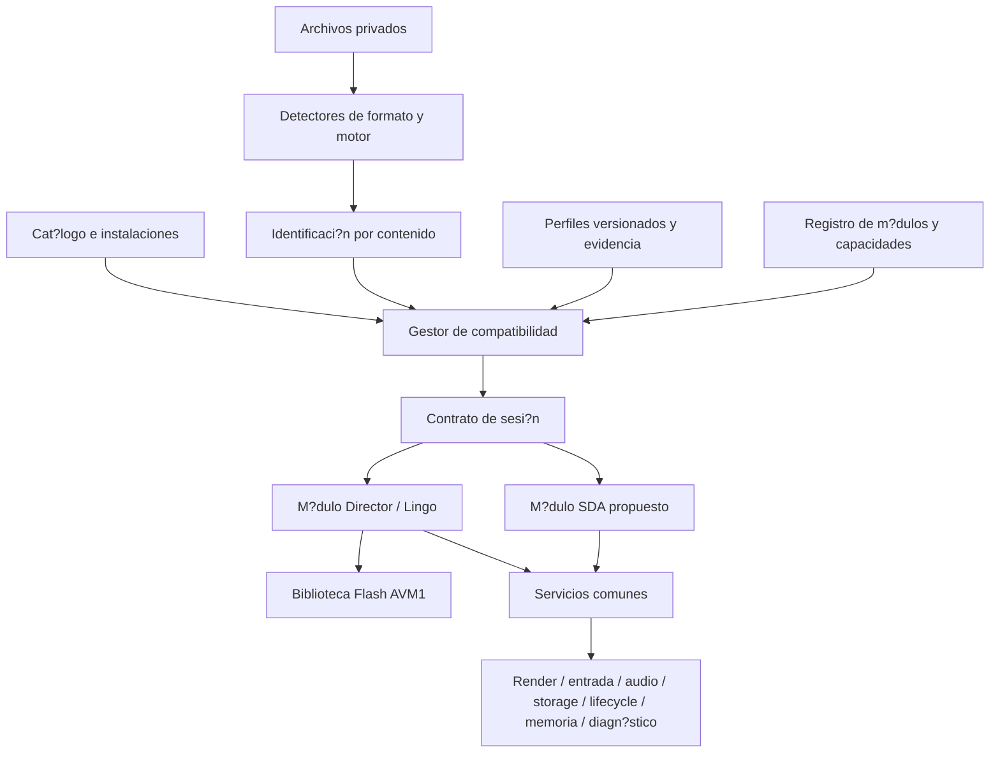

# Arquitectura multijuego de Case-Recomp

Fecha: 2026-10-08. Propuesta de evoluci?n fundada en [auditor?a Huntsville](HUNTSVILLE_COMPATIBILITY_AUDIT.md) y [auditor?a Mystery P.I.](MYSTERY_PI_VEGAS_AUDIT.md). **Especificaci?n, todav?a no implementaci?n.** La investigaci?n previa queda documentada; se conserva el runtime existente sin refactorizar ni borrar m?dulos.

## Decisi?n y estado actual

Case-Recomp ser? una plataforma de compatibilidad con servicios Android compartidos y m?dulos por tecnolog?a. Los t?tulos aportan identidad, recursos y perfiles declarativos. Las correcciones generales pertenecen al motor o al servicio correspondiente.

Hoy existen dos m?dulos Gradle (`:engine`, `:app`). El primero contiene shell Scenario, evidencias, Director/Lingo y Flash; el segundo contiene servicios Android mezclados con Director. `HomeActivity` tiene cat?logo fijo y `PrivateDirectorRepository` mantiene un ?nico paquete activo. El convertidor web busca una pel?cula Director y reconoce Huntsville por cuatro nombres de casts; no verifica edici?n. Los ZIPs tienen integridad/source binding, pero no una identidad de juego acreditada. La persistencia Director usa el SHA del ZIP, por lo que otra conversi?n del mismo original separa los saves.

La copia local de Huntsville sirve de primera referencia real; la ejecuci?n JVM se ha vuelto a comprobar, pero sus resultados WSA completos son hist?ricos. Mystery P.I. tiene evidencia de SDA/SDL/BASS nativo x86, no un m?dulo disponible. Prime Suspects y Ravenhearst son entradas visuales en desarrollo, no compatibilidad demostrada.

## Capas y responsabilidades



| Componente | Responsabilidad | L?mites |
|---|---|---|
| Core de plataforma | identidad de instalaci?n/sesi?n, capacidades, contratos, reloj y errores estructurados | Sin CastMember, LingoValue, Score, tags MPI ni if por nombre comercial. |
| Detectores | cabeceras, formatos y fingerprints; presupuestos de I/O y profundidad | No ejecutan PE, scripts o instaladores; resultado de detecci?n no equivale a compatibilidad. |
| Gestor de compatibilidad | resolver identidad?perfil?m?dulo, comparar ABI/capacidades y estado de verificaci?n | No inventa sem?nticas ni permite que el manifest privado se autoacredite como juego verificado. |
| Registro/cat?logo | perfiles conocidos, versiones, estado, pruebas y presentaci?n | Una card o `ready` no habilita por s? sola ejecuci?n. |
| Instalaciones privadas | staging, validaci?n, activaci?n at?mica, inventario y rollback | Almacenamiento separado por instalaci?n; una importaci?n fallida no reemplaza otra. |
| Director | contenedores/casts, Score, Lingo, eventos, ink y Xtras | Sigue reutilizable por tecnolog?a; adaptador exporta frames/eventos mediante contratos comunes. |
| SDA propuesto | recursos PE/RAWDATA, XUI, componentes y ejecuci?n verificada | Sin contaminaci?n de Director; ruta nativa pendiente de determinar. |
| Servicios Android | presentaci?n, input, audio, persistencia, lifecycle, recursos y diagn?stico | Implementaci?n com?n; los adaptadores tecnol?gicos traducen sus sem?nticas. |
| Referencias legacy | shell sint?tico, `.crcontent/.crflow/.crscene`, fixtures y pruebas | Se preservan. No son fallback autom?tico para l?gica no implementada por el nuevo runtime. |

Primero introducir paquetes Kotlin y adaptadores dentro de los m?dulos actuales. Dividir Gradle despu?s, cuando existan l?mites y pruebas estables: `core-api`, `android-host`, `runtime-director`, `runtime-sda` y, si aporta valor real, `format-tools`. Evitar nuevos m?dulos vac?os y migraciones masivas de archivos.

## Contratos entre runtime y servicios

Los tipos siguientes son pseudoc?digo de contrato, no clases a?adidas al motor:

```kotlin
interface RuntimeModule {
    val descriptor: ModuleDescriptor  // id, moduleVersion, hostAbiRange, capabilities
    fun inspect(content: ReadOnlyContent, budget: ProbeBudget): EngineProbe
    fun prepare(plan: ResolvedLaunchPlan, host: HostServices): RuntimeSession
}
interface RuntimeSession : AutoCloseable {
    val state: SessionState
    fun start(): SessionResult
    fun advance(nowNs: Long): FrameResult
    fun input(event: HostInputEvent): SessionResult
    fun pause(reason: PauseReason): SessionResult
    fun resume(): SessionResult
    fun flushPersistentState(): SessionResult
    // close() is idempotent and releases resources even after partial prepare.
}
```

`ResolvedLaunchPlan` contiene identidad verificada, revisi?n del perfil, digest de configuraci?n resuelta, m?dulo/ABI, capacidades concedidas, handles privados y budget. Se genera por el gestor, nunca tomando esos datos del paquete como autoridad. La preparaci?n puede fallar con `missing-capability`, `unverified-edition`, `unsupported-format`, `ambiguous-identity`, `corrupt-content` o `budget-exceeded` antes de construir el runtime.

`HostServices` contiene puertos tecnol?gicos independientes:

| Puerto | Contrato m?nimo | C?mo conservar lo actual / prueba |
|---|---|---|
| FrameSink / Surface | frame ARGB o comandos acotados con tama?o, stride, formato alpha/color y token de ownership; letterbox y coordenadas l?gicas | Director convierte `LingoImage` dentro de su adaptador. Presentaci?n no interpreta Score ni ink. Comparar pixel/alpha y touch map. |
| InputSource | pointer id/tool, coordenadas l?gicas, timestamps monot?nicos, move/down/up/cancel/hover y eventos de texto/tecla separados | Touch rollover es pol?tica expl?cita; eventos externos cancelados en pause/close. Orden y fuera del stage id?nticos. |
| AudioService | handles privados, canales/voices, gain, loops, fade, posici?n y completions con clock; prepare/play/pause/stop idempotentes | `SoundOutput` sigue en Director como fachada. No pasar `CastMember` al servicio. Callback prepared respeta estado pausado y generation id. |
| StorageService | namespace por instalaci?n/familia de save, KV l?gico + archivos binarios acotados, escritura at?mica y flush | `DirectorStore` traduce claves legacy. FileIO/registro permanecen adapters. No exponer rutas arbitrarias del host. |
| ContentService | enumeraci?n declarada y lectura aleatoria/streaming de blobs verificados e inmutables | Director conserva su validador ZIP. SDA usa validador de formato propio. L?mites de profundidad, archivos, descompresi?n, pixels y tiempo. |
| Clock / Scheduler | reloj monot?nico inyectable, cadence solicitada por runtime, pausa sin salto arbitrario de tiempo | DeterministicClock en pruebas; frame rate original se respeta. Datos de ticks no se deducen del nombre del juego. |
| Text / Image services | decodificaci?n acotada, glyph metrics/layout request sin tipos Director, font assets/atlas y alpha definido | Primero adaptar decoder ya acotado. Font mapping y atlas son providers; no trasladar heur?sticas a todos los juegos. |
| ResourceBudget | reservas y liberaciones por decoded media, superficies, cache y audio; cancelaci?n y expulsi?n medidas | Budget global engloba el heap/host; los m?dulos pueden imponer l?mites m?s estrictos. Perfil s?lo puede reducir l?mites. |
| Diagnostics | eventos estructurados, m?tricas por sesi?n, warnings clasificados y trazas privadas opt-in | No loguear rutas/usernames/raw scripts en reporte p?blico. Separar unsupported operation de dispatch v?lido. |
| SessionEvents | quit, error, loading, ready, needs-input y estado persistente | `quitRequested` pasa al lifecycle com?n; no hay transici?n de escena implementada por el host. |

Un ?nico propietario serializa el estado de cada sesi?n. Preparaci?n/decodificaci?n puede usar workers; eventos y callbacks vuelven con token de generaci?n para evitar operar sobre una sesi?n cerrada. Ownership de frame, hilo y validez del buffer se negocian; no compartir `Paint`, VM mutable o buffers entre sesiones.

Lifecycle: `PREPARING ? READY ? RUNNING ? PAUSED ? CLOSED`, con `FAILED` desde estados activos. `start` s?lo una vez; pause/resume repetidos seguros. Pausa cancela gestos, conserva progreso y detiene avance temporal/audio. Stop/muerte de proceso recupera persistencia comprobada; no prometer serializar una VM completa si s?lo se preservan saves del juego. Close libera parcialmente preparados y completa flush necesario. Foco/audio/IME se gestionan por host.

## Detecci?n e identificaci?n extensibles

1. Inventariar archivos bajo budgets; particionar candidatos por grafo de dependencias y procedencia. No mezclar autom?ticamente dos juegos encontrados en la misma selecci?n.
2. Aplicar inspectores de formatos por contenido: PE, RIFF/XFIR, pel?culas/casts Director, recursos PE/SDA y formatos desconocidos. Extensi?n/nombre s?lo son pistas para priorizar.
3. Construir `EngineProbe` con familia candidata, rango/versi?n observado, evidencia y confianza. No ejecutar imports nativos. Cadenas de un SDK apoyan una hip?tesis; no determinan por s? solas edici?n o compatibilidad.
4. Comparar fingerprints obligatorios contra un registro de fuentes conocidas. La coincidencia exacta multiarchivo exige todos los digests, tama?os y roles cr?ticos de la variante registrada. Resolver aliases/rutas relativas sin confiar en un nombre ?nico.
5. Distinguir `exact`, `engine-only`, `ambiguous`, `unknown`, `incomplete`, `corrupt` y `mixed-input`. Dos perfiles v?lidos son ambig?edad; no ganar por orden de lista ni seleccionar el exe mayor como identidad.
6. S?lo con `exact` resolver perfil de esa edici?n, revisar ABI/capacidades y construir plan. Huellas parciales/fuentes alteradas informan edici?n no verificada; no activan excepciones de un juego conocido.
7. Un modo de investigaci?n de motor gen?rico puede abrir un candidato desconocido ?nicamente con defaults sin excepciones, rotulado sin compatibilidad comprobada. No marcarlo como Huntsville ni como SDA verificado.

El mismo registro declarativo abastece detector offline, convertidor web y cat?logo Android; publicar revisiones reproducibles, no copiar otra lista TITLES. La app contrasta identificaci?n contra originales accesibles o contra una identificaci?n emitida por un proceso confiable y verificable. Si los originales no est?n incluidos ni disponibles, un campo `source_sha256` autoafirmado no acredita edici?n: se conserva la identidad como no verificada. Dise?ar el enlace del convertidor al registro local o una atestaci?n autenticada es una dependencia expl?cita de M4. Integridad del ZIP no demuestra autor?a, edici?n ni verificaci?n. Paquetes legacy conservan validaci?n e importaci?n gen?rica actual con indicaci?n de identidad sin verificar cuando falten fingerprints de casts.

## Instalaciones y guardados multijuego

Mantener varias instalaciones y un selector activo separado. `GameId`, `EditionId`, `InstallId`, `SourceSetDigest` y `PackageDigest` son conceptos distintos. El source set identifica originales; package digest identifica una conversi?n concreta y puede cambiar por codec/cover. Un install id es local e inmutable. Perfiles no deben incluir claves o saves del usuario.

Saves nuevos: namespace compuesto por instalaci?n + `saveFamilyId` + formato/versi?n. Compartir entre conversiones o ediciones requiere una migraci?n expl?cita y probada, nunca s?lo nombres iguales. Para Huntsville, mantener el acceso a `case-recomp-director-user-data` bajo el prefijo SHA de ZIP exacto. Un adapter lee namespace legacy; copia a uno nuevo ?nicamente con mapping verificado y transacci?n, retiene el original y permite rollback. No unir autom?ticamente saves de dos paquetes.

El paquete exterior futuro puede tener envelope com?n de engine/payload/entry hashes/source roles. Es un transporte, no un formato de juego ni una nueva VM. Cada m?dulo valida payload y source binding. Director v1 permanece aceptado por su loader; SDA debe tener identidad/formato propio. No renombrar bytes incompatibles a `.director.zip`.

## Migraci?n de Huntsville

La primera implementaci?n debe ser un wrapper: DirectorRuntime, LingoVm y StageRenderer intactos detr?s de `RuntimeSession`, con puertos que reenv?an a los adaptadores actuales. Capturar la configuraci?n impl?cita actual como snapshot de baseline para pruebas. No ocultar calibraciones en un default compartido para todo juego.

La edici?n local debe registrarse con huellas del exe y casts originales, idioma corroborado y alias de versiones; la VM esperada es Director 8.5.1 observado. S?lo despu?s de pruebas de perfil se mueven los datos de fuentes/offsets del c?digo a un perfil de esa edici?n. Mantener sus efectos equivalentes primero; investigarlos/retirarlos en cambios independientes.

Paquetes previamente importados siguen funcionando mediante su ruta legacy, sin recibir ajustes nuevos de otros t?tulos. Si no incluyen evidencia suficiente de identidad, mostrar no verificado y conservar rollback; una migraci?n futura a excepciones seleccionadas exige reconstruir su provenance desde originales o un ?ndice local comprobado. No convertir silenciosamente todos los ZIPs existentes en Huntsville.

Orden: identidad y baseline ? interfaces/adaptador sin cambios sem?nticos ? instalaci?n y almacenamiento ? resoluci?n de perfiles ? extracci?n controlada de calibraciones ? servicios comunes de audio/presentaci?n ? investigaci?n SDA. Cada etapa corre suite sint?tica y matrix privada antes/despu?s; no eliminar el shell previo ni golden captures.

## Plan incremental con dependencias y criterios

| Cambio propuesto | Justificaci?n | Dependencias | Riesgo | Pruebas / salida |
|---|---|---|---|---|
| M0: congelar fuente/evidencia y registrar baseline | Saber qu? se preserva | auditor?as y huellas locales | confundir historial WSA con test nuevo | suites actuales + evidencia nativa versionada; matriz con estados reales. Auditor?a y baseline de c?digo ya hechos; captura nativa nueva pendiente. |
| M1: registro y detector, inicialmente s?lo lectura | Sustituir casts/card fijos sin alterar play | contrato de fingerprints y schema | falsa identidad y mezcla de fuentes | multiarchivo exacto, rename inocuo, modificaci?n 1 byte, edici?n desconocida, ambig?edad, dos juegos. No activar perfiles todav?a. |
| M2: core contracts + Director wrapper | Conservar comportamiento detr?s de API com?n | M0, contrato de sesi?n | orden de eventos, callbacks y cleanup | traces/frame hashes baseline vs wrapper; tests lifecycle, clocks, errores y budgets. |
| M3: ?ndice de instalaciones y adapter legacy de saves | Selecci?n real de varios juegos | M1/M2; formatos originales intactos | p?rdida o cruce de saves | reimport, cambio de conversion, dos instalaciones, rollback, muerte de proceso e import fallido at?mico. |
| M4: resolver perfiles y capacidades | Activar s?lo excepciones comprobadas | M1/M2/M3, schema/ABI y fuente exacta | perfil manipulado o fallback incorrecto | incompatibilidad de versiones, capacidad faltante, valor desconocido, evidence/retirement obligatorio. |
| M5: sacar calibraciones Huntsville del c?digo global | Evitar contaminar t?tulos futuros | M4 y goldens de texto/gestos/offset | wrap/baseline/hit-test cambia | misma edici?n con valores equivalentes, otro Director sint?tico sin ajustes, nudges on/off, dos Android. Una excepci?n por cambio. |
| M6: factorizar servicios comunes | Reutilizar infraestructura comprobada | M2 y contratos de recursos | audio latency/alpha/memoria | eventos prepared durante pause, efectos concurrentes, atlas, bounds, allocations, p95/p99. No sustituir sem?ntica Director de ink. |
| M7: cerrar factibilidad SDA | Evitar port espec?fico sin runtime real | investigaci?n XUI + grafo nativo + capturas | l?gica nativa no descrita por recursos | parser sint?tico y contrato m?nimo cerrado; decidir ejecuci?n compatible, traducci?n o emulaci?n. Sin play comercial en cat?logo. |
| M8: primer slice SDA detr?s de interfaces | Validar segundo motor y servicios | M3/M4/M6/M7 | hardcode de l?gica del t?tulo | slice nativo con input/audio/save vs original y regresiones Huntsville antes/despu?s. No declarar juego completo. |
| M9: cat?logo y crecimiento controlado | Incorporar juegos sin duplicar core | matrix de aceptaci?n por edici?n | soporte por nombre/versi?n incorrecto | publicaci?n de estado y evidencia revisada; detector/Android/web usan misma revisi?n del registro. |

Cada milestone debe ser un cambio acotado y reversible; una falla bloquea su promoci?n y no obliga a modificar el runtime anterior. No se fija un calendario de SDA antes de comprobar su ruta de ejecuci?n.

## Rendimiento, mantenimiento y escalabilidad

Con 800?600 y escala 2, un framebuffer ARGB ocupa 7.680.000 bytes; dos copias frame/Bitmap suman 15.360.000 antes de otros caches. La escala se elige por budget/dispositivo y fidelidad, no siempre 2. Los valores hist?ricos WSA de 30 fps/~90 MB son de cargas espec?ficas: no son una garant?a Android ni un budget portable.

Medir p50/p95/p99 de tick, composici?n y input?frame, frames perdidos, tiempo de startup/import, heap/PSS, decoded cache, audio prepare/latency y fugas tras abrir/cerrar repetidamente. Baseline y candidato usan misma APK configuraci?n, dispositivo, originales, saves, clock, random seed y secuencia de acciones. El stage se procesa en UI thread actualmente; moverlo a worker/GPU es proyecto posterior con prueba de orden y alpha.

Primera versi?n multijuego ejecuta una sesi?n a la vez. No necesita paralelismo de varios juegos ni decodificaci?n total del DLL de Mystery P.I.; usa recursos bajo demanda. Cache key incluye instalaci?n/resource/decoder/config, no s?lo nombre de miembro. Cancelar todos los callbacks al cambiar de juego y separar caches/saves/audio.

Cada tecnolog?a mantiene su parser/runtime y pruebas; todo c?digo com?n depende s?lo del core API. El costo de agregar un t?tulo compatible es fingerprints + perfil + evidencia, no clonar motor. Un formato nuevo puede justificar un m?dulo nuevo. No descargar c?digo desde perfiles ni introducir scripts arbitrarios de configuraci?n.

Ver [especificaci?n de perfiles](GAME_COMPATIBILITY_PROFILE.md) y [plan de regresiones](MULTIGAME_REGRESSION_PLAN.md). La auditor?a no incorpora a?n Mystery P.I. al launcher ni al convertidor, y no declara compatibilidad nueva.

## Stage 1 implementation checkpoint (2026-10-08)

The app-side presentation registry is implemented and tested on WSA. See
[Huntsville presentation isolation](HUNTSVILLE_PRESENTATION_ISOLATION.md) for the
exact moved values, verified bundle selection, preserved generic behavior and
limits. Status: `APROBADO_HUMANAMENTE` (2026-10-08). Mystery P.I. Stage 2 is
explicitly authorized. See [approved baseline](HUNTSVILLE_APPROVED_REFERENCE.md).


## Stage 2: native-code investigation (2026-10-08)

Human authorization is recorded in [Huntsville approved baseline](HUNTSVILLE_APPROVED_REFERENCE.md).
Ghidra analysis and original Windows reference observations are documented in
[Mystery P.I. native research](MYSTERY_PI_NATIVE_RESEARCH.md). No SDA runtime or
Android compatibility is claimed; native rule reconstruction and the playable
prototype remain outstanding.

## Experimento de fuentes de Huntsville (2026-10-08)

Se extrajeron seis fuentes PFR1 del ejecutable original y se preparó una app de
comparación de Tekton normal/itálica, independiente del player aprobado. La
conversión tiene defectos visuales y no se adopta en Huntsville. Resultados,
límites y protección de la referencia en
[HUNTSVILLE_FONT_EXPERIMENT.md](HUNTSVILLE_FONT_EXPERIMENT.md).
