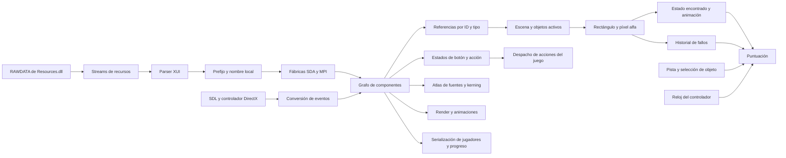

# Mystery P.I. — reconstrucción estática de SDA

Fecha: 2026-10-08. Estado: prototipo experimental de interacción con una escena;
compatibilidad de campaña y comparación con el original pendientes.

La instrucción vigente es dejar el original de lado. Este trabajo consume el
pseudocódigo ya exportado y los recursos como datos. Ghidra analiza el PE sin
lanzarlo. No se usa ratón/teclado del escritorio ni se cambia Huntsville.
Cuando una hipótesis requiera contraste nativo, se solicitará al usuario el acceso
al escritorio antes de ejecutar o manejar el original.

## Mapa de dependencias

Los nombres siguientes son roles asignados durante el análisis. Las direcciones
son VA del PE original con base 0x00400000. Los prototipos inferidos por Ghidra
no son un ABI confirmado.

Este diagrama expresa las relaciones revisadas. El JSON privado generado por
`tools/sda-prototype/map_dependencies.py` conserva las llamadas directas concretas,
sus direcciones y profundidad. La primera generación tiene 51 raíces revisadas,
1.607 nodos y 5.152 aristas directas, recorriendo tres niveles desde las raíces.
No es cierre de todas las llamadas indirectas del motor.

| Área | Funciones revisadas | Evidencia |
| --- | --- | --- |
| Recursos PE | 0048ffb0, 00490b40, 0048f9c0 | Registro del módulo y stream RAWDATA. |
| XUI | 00470f98, 004714d8, 00471549, 0048051b, 00480644 | Carga, callbacks de apertura/cierre y creación de nodos. |
| Fábricas | 0048c2a9, 00462050, 00464300 | Creación SDA, creación MPI y selección del loader por tipo. |
| Preparación de escena | 0040c6f0, 0040a720 | Carga del documento, registro de fábricas y enlace de componentes. |
| Acciones del juego | 00412300 | Despacho por valor de acción; contiene rutas de interfaz y juego. |
| Recorridos | 00480d13 | Máscara: traverse=1, update=2, render=4, events=8. |
| Botón | 004884f9, 00487cd7, 004882e9 | Hit-test rectangular, estados y render según el estado. |
| Objetos | 004251f0, 00473e0e, 004277e0, 004278e0 | Selección activa, lectura alfa, estado encontrado y cambio de jerarquía para animación. |
| Sets | 004657e0 | Resuelve referencias `objects` y nombres del set; puede contener varios objetos. |
| Actualización | 00425140 | Acumula el intervalo desde el último acierto y actualiza estado de pista. |
| Puntuación | 00452f10, 00453430, 00453830, 00453950, 004539c0 | Inicialización, objetos, fallos rápidos, pistas y coleccionables. |
| Fuente | 0048df06, 0048dff3 | Atlas, baseline, spacing, spacewidth, characterset y pares de kerning. |
| Guardado | 004061a0, 00408510 | Serialización de lista de jugadores y progreso; no se adopta aún su formato. |
| Entrada | 004905b0, 00492de0, 00492800, 004b71d0 | Wrapper del controlador, espera/conversión de evento y procedimiento Windows. |

La exportación completa previa contenía 5.906 funciones reconocidas. Dos objetivos
indirectos estaban etiquetados como código sin función y no aparecían en ella:
004b71d0 y 00462050. Se definieron explícitamente en el proyecto privado y se
exportaron con sus dependencias. El corte nuevo completó 600 decompilaciones.
Esto demuestra por qué ese conteo anterior no garantizaba cobertura del código.
El procedimiento Windows conserva advertencias de saltos indirectos sin recuperar.

`00474ab0` contiene nombres diagnósticos cuyos valores MPI no coinciden con los
constructores y loaders de este juego. No se usa ese switch para asignar tipos.
Por ejemplo, el constructor de eyespyarea establece 0x6d, el de eyespyimage 0x6f
y el de score 0x98; se corroboran con la fábrica y el loader reales.

## Eventos y reglas recuperadas

`00492800` traduce eventos a una estructura de 20 bytes. El botón procesa
movimiento tipo 3, pulsación tipo 4 y liberación tipo 5. Sus estados son normal=0,
hover=1, pulsado dentro=2, arrastre fuera=3 y deshabilitado=4. Una liberación dentro
tras pulsar dentro marca la acción; salir arrastrando evita ese acierto.

La escena de objetos comprueba el tipo 4 y el botón izquierdo. Recorre los sets
activos y sus objetos, ignora los ya encontrados, comprueba límites semiabiertos
y consulta el píxel de la textura. El ensamblador en 004254bf empuja el canal 3
antes de llamar a 00473e0e: se confirma alfa, y cualquier valor distinto de cero
cuenta. Un rectángulo opaco inventado produciría aciertos falsos en transparencias.

| Regla | Comportamiento observado estáticamente |
| --- | --- |
| Objeto | Suma 5.000 puntos. |
| Acierto rápido | Intervalo de actualización menor que 3,0 segundos. Primer bonus 2.500; los consecutivos aumentan 1.000 hasta 15.500. |
| Acierto lento | Suma sólo 5.000 y reinicia la cadena/bonus a 2.500. |
| Pista | Resta 7.500, con mínimo de puntuación cero. |
| Fallos rápidos | Las primeras cinco llamadas llenan el historial. La sexta desplaza el historial y comprueba la ventana de las últimas cinco marcas; si abarca como máximo 2.000 ms y la puerta permite penalizar, resta 2.500 y borra el historial. |
| Explicación de penalización | 004111d0 consulta un flag del jugador. La primera explicación puede impedir la resta; no se omite al reconstruir la campaña. |
| Coleccionable | Una ruta adicional suma 10.000; su contexto y tipos requieren continuar la revisión. |

Para el bonus de objetos, el ensamblador en 004257a1 compara el acumulador de la
escena +0x15c con el float 3,0 en 005075b8; pasa un booleano a 00453430 y después
reinicia el acumulador. No debe confundirse con 004532c0, que otorga 150/200 puntos
por otros aciertos y aparece en rutas de minijuegos.

Las cantidades y condiciones son evidencia estática, no resultados de una nueva
partida del original. Sigue pendiente validar animaciones, diálogo inicial de
penalización, selección aleatoria, pausa y guardado contra una hipótesis concreta.

## Prototipo y evidencia actual

`tools/sda-prototype/` contiene código experimental independiente. Lee Resources.dll
como un archivo PE; no ejecuta la DLL ni necesita lanzar el EXE. Carga la escena,
texturas y posiciones originales, mantiene el estado encontrado y procesa
aciertos/fallos usando alfa y las reglas de puntuación anteriores.

Se generó una imagen privada de la bóveda y otra tras tres aciertos. La prueba
headless utiliza píxeles alfa reales de los objetos seleccionados; obtuvo ganancias
de 5.000, 7.500 y 8.500 y un total de 21.000. Los artefactos y el registro están en
`private/mystery-pi-vegas/research/prototype/`. Se verificaron seis pruebas que cubren
límites alfa, cadena/cap del bonus, ventanas de fallo, puerta de penalización,
wrap del reloj de 32 bits, suelo de puntuación y parsing XUI.

La selección es explícita y admite sets de un objeto. La ventana interactiva está
preparada con `--interactive`, pero no se abrió durante este trabajo. Sus controles
son de investigación. No implementa todavía el menú original, selección de
campaña, sets compuestos, coleccionables, atlas/localización, animaciones, audio,
pausa, guardado ni victoria. La desaparición inmediata del sprite permite comprobar
la mutación, pero debe sustituirse por la animación nativa recuperada.

El siguiente trabajo es enlazar esas dependencias reales al prototipo y contrastar
hipótesis precisas con el original cuando el usuario ceda el escritorio. Android
se conecta después de comprobar el funcionamiento. Huntsville y su APK aprobada
permanecen separados de este experimento.

## Atlas originales, localización y primera vista del menú

La continuación se realizó con pseudocódigo y lectura estática de los PE, sin
abrir ni manejar el original. `tools/sda-prototype/fonts.py` añade una recuperación
independiente de texto a partir de los atlas originales. No cambia Director, el
perfil de Huntsville, Android ni la APK aprobada.

| Función | Evidencia recuperada |
| --- | --- |
| 0047e078 | Recorre columnas de toda la altura; considera tinta si algún alfa supera 4. Cierra el glifo en la primera columna vacía posterior. Límite de 256 entradas; no cierra automáticamente una franja que alcanza el borde derecho. |
| 0047d822 | Convierte charset UTF-8 a UTF-16 y registra índices; una aparición posterior de un carácter duplicado reemplaza su índice anterior. |
| 0047da4b | Avance entero por truncamiento de ancho × spacing float; espacio configurable. La altura viene del atlas. |
| 0047ddd4 | Dibuja el recorte original a toda su altura, sin escalarlo horizontalmente por spacing; modos verticales inferior, baseline, centro y superior. |
| 0048dff3 / 0047dbbd | Pares de kerning cargados con el primer byte UTF-8; búsqueda por los bytes bajos de los caracteres al dibujar. |
| 00472124 / 004725b0 | El ancho de alineación suma avances sin kerning; el dibujado sí añade kerning. El escape literal de nueva línea avanza tres cuartos de la altura. |
| 0048aad0 | Renderer virtual de label, slot 7 en vtable 0050896c: centra con ajuste de −1 píxel y traduce alineación del label a modos del texto. |
| 0048d003 / 004882e9 | Bounds del botón sin w/h explícitos se derivan de las texturas de sus estados. Caption centrado; offset local de caption corresponde al estado pulsado, mientras el global afecta al normal. |
| 0046ebf4 / 0046ed14 / 00471872 | Tabla de textos: clave desde la primera I hasta =, eliminación de whitespace final, valor entre primera/última comilla. Lookup de atributos @ID; si falta se conserva el atributo. |

El escape vertical presente en el botón principal usa dos dígitos. Se comprobó
su bloque x86 en 0047285f–004728a1: el acumulador también multiplica por el índice
del dígito, por lo que no se sustituye toda la rutina por un parser decimal general.
El prototipo admite avances de uno/dos dígitos y rechaza los más largos y otros
estilos hasta recuperar su comportamiento completo. Tampoco implementa el estado
global de color/alfa, clipping jerárquico ni todos los caminos de texto de SDA.

El sondeo de ENVS encontró 56 definiciones: 35 atlas presentes y 21 referencias a
recursos ausentes. No se crean sustitutos para esas referencias. De los presentes,
34 tienen igual número de franjas cerradas y unidades de charset; la excepción es
fnt_maplabelnumberlrg. Su lista omite el paréntesis de cierre, mientras el atlas
presenta 189 franjas. Se registra la discrepancia sin corregir la fuente de datos
ni afirmar equivalencia visual a partir de un conteo. STRINGS.TXT aportó 286 claves;
las etiquetas de objetos se resuelven además con la tabla de la escena.

Se generaron y revisaron visualmente los artefactos privados:

- `research/prototype/fonts/original-fonts.png`: tres fuentes y captions originales.
- `research/prototype/fonts/atlas-scan.json`: métricas, discrepancias, ausentes y hash del DLL.
- `research/prototype/menu-initial.png` y JSON: 11 elementos dibujados y siete botones con sus valores/rectángulos, obtenidos del XUI.

El menú es una vista estática con el padre activado para la prueba. Conserva los
flags originales de sus hijos y no inventa el nombre del jugador; siguen pendientes
el binding del jugador, logo/faders, navegación y estados de desbloqueo. No se
confunde esta imagen con una partida iniciada ni con una comparación contra el EXE.

La acción 299 del botón principal tiene rutas en 00412300 y 00414af0. La primera
depende de +0x410 y flags +0x5ee/+0x5ed, puede llamar 00406cc0 o mostrar un diálogo;
la segunda programa transición +0x4c4=0x26 mediante 00404950. Por eso aún no se
implementa como un salto directo inventado a la bóveda. El siguiente enlace exige
recuperar estas transiciones y la selección real de objetivos.

Pasaron 14 pruebas: las seis de escena/puntuación anteriores y ocho de atlas,
umbral, límite de entradas, charset duplicado, avance sin deformar píxeles,
centrado/kerning, alineación vertical, escapes y localización. Son fixtures propios;
la comparación diferencial con el original permanece pendiente de una hipótesis
concreta y del acceso al escritorio autorizado por el usuario.
