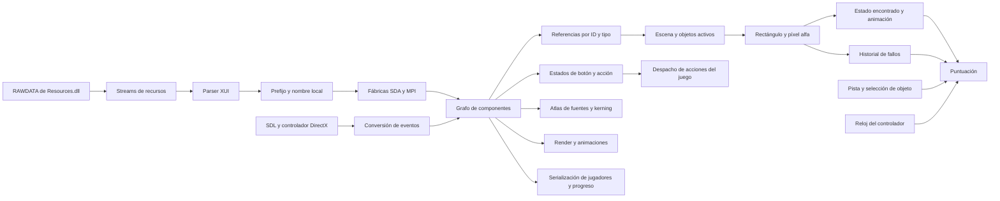
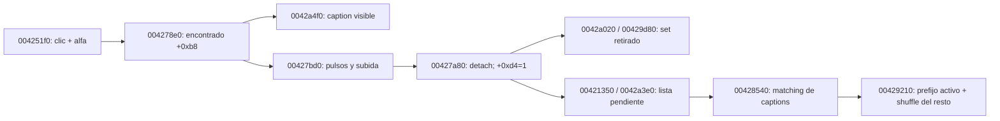
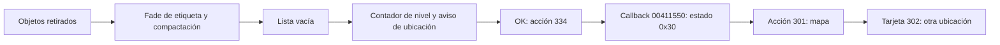

# Mystery P.I. — reconstrucción estática de SDA

> **Auditoría 2026-10-09:** las afirmaciones previas de bonus/desenlace auténticos y campaña completa no están verificadas; existen mecanismos simulados en Kotlin y supuestos en Python. Véase [estado comprobado y pendientes](MYSTERY_PI_ANDROID_AUDIT.md).

Fecha de actualización: 2026-10-09. Estado: recorrido experimental de inicio,
primera tanda, avance a otra ubicación y reanudación verificado por la interfaz.
Reconstrucción del grafo nativo y comparación con el original pendientes.

La instrucción vigente es dejar el original de lado. Este trabajo consume el
pseudocódigo ya exportado y los recursos como datos. Ghidra analiza el PE sin
lanzarlo. No se usa ratón/teclado del escritorio ni se cambia Huntsville.
Cuando una hipótesis requiera contraste nativo, se solicitará al usuario el acceso
al escritorio antes de ejecutar o manejar el original.

## Mapa de dependencias

Los nombres siguientes son roles asignados durante el análisis. Las direcciones
son VA del PE original con base 0x00400000. Los prototipos inferidos por Ghidra
no son un ABI confirmado.

Este diagrama expresa las relaciones revisadas. El JSON privado generado por
`tools/sda-prototype/map_dependencies.py` conserva las llamadas directas concretas,
sus direcciones y profundidad. La primera generación tiene 51 raíces revisadas,
1.607 nodos y 5.152 aristas directas, recorriendo tres niveles desde las raíces.
No es cierre de todas las llamadas indirectas del motor.

| Área | Funciones revisadas | Evidencia |
| --- | --- | --- |
| Recursos PE | 0048ffb0, 00490b40, 0048f9c0 | Registro del módulo y stream RAWDATA. |
| XUI | 00470f98, 004714d8, 00471549, 0048051b, 00480644 | Carga, callbacks de apertura/cierre y creación de nodos. |
| Fábricas | 0048c2a9, 00462050, 00464300 | Creación SDA, creación MPI y selección del loader por tipo. |
| Preparación de escena | 0040c6f0, 0040a720 | Carga del documento, registro de fábricas y enlace de componentes. |
| Acciones del juego | 00412300 | Despacho por valor de acción; contiene rutas de interfaz y juego. |
| Recorridos | 00480d13 | Máscara: traverse=1, update=2, render=4, events=8. |
| Botón | 004884f9, 00487cd7, 004882e9 | Hit-test rectangular, estados y render según el estado. |
| Objetos | 004251f0, 00473e0e, 004277e0, 004278e0 | Selección activa, lectura alfa, estado encontrado y cambio de jerarquía para animación. |
| Sets | 004657e0 | Resuelve referencias `objects` y nombres del set; puede contener varios objetos. |
| Actualización | 00425140 | Acumula el intervalo desde el último acierto y actualiza estado de pista. |
| Puntuación | 00452f10, 00453430, 00453830, 00453950, 004539c0 | Inicialización, objetos, fallos rápidos, pistas y coleccionables. |
| Fuente | 0048df06, 0048dff3 | Atlas, baseline, spacing, spacewidth, characterset y pares de kerning. |
| Guardado | 004061a0, 00408510 | Serialización de lista de jugadores y progreso; no se adopta aún su formato. |
| Entrada | 004905b0, 00492de0, 00492800, 004b71d0 | Wrapper del controlador, espera/conversión de evento y procedimiento Windows. |

La exportación completa previa contenía 5.906 funciones reconocidas. Dos objetivos
indirectos estaban etiquetados como código sin función y no aparecían en ella:
004b71d0 y 00462050. Se definieron explícitamente en el proyecto privado y se
exportaron con sus dependencias. El corte nuevo completó 600 decompilaciones.
Esto demuestra por qué ese conteo anterior no garantizaba cobertura del código.
El procedimiento Windows conserva advertencias de saltos indirectos sin recuperar.

`00474ab0` contiene nombres diagnósticos cuyos valores MPI no coinciden con los
constructores y loaders de este juego. No se usa ese switch para asignar tipos.
Por ejemplo, el constructor de eyespyarea establece 0x6d, el de eyespyimage 0x6f
y el de score 0x98; se corroboran con la fábrica y el loader reales.

## Eventos y reglas recuperadas

`00492800` traduce eventos a una estructura de 20 bytes. El botón procesa
movimiento tipo 3, pulsación tipo 4 y liberación tipo 5. Sus estados son normal=0,
hover=1, pulsado dentro=2, arrastre fuera=3 y deshabilitado=4. Una liberación dentro
tras pulsar dentro marca la acción; salir arrastrando evita ese acierto.

La escena de objetos comprueba el tipo 4 y el botón izquierdo. Recorre los sets
activos y sus objetos, ignora los ya encontrados, comprueba límites semiabiertos
y consulta el píxel de la textura. El ensamblador en 004254bf empuja el canal 3
antes de llamar a 00473e0e: se confirma alfa, y cualquier valor distinto de cero
cuenta. Un rectángulo opaco inventado produciría aciertos falsos en transparencias.

| Regla | Comportamiento observado estáticamente |
| --- | --- |
| Objeto | Suma 5.000 puntos. |
| Acierto rápido | Intervalo de actualización menor que 3,0 segundos. Primer bonus 2.500; los consecutivos aumentan 1.000 hasta 15.500. |
| Acierto lento | Suma sólo 5.000 y reinicia la cadena/bonus a 2.500. |
| Pista | Resta 7.500, con mínimo de puntuación cero. |
| Fallos rápidos | Las primeras cinco llamadas llenan el historial. La sexta desplaza el historial y comprueba la ventana de las últimas cinco marcas; si abarca como máximo 2.000 ms y la puerta permite penalizar, resta 2.500 y borra el historial. |
| Explicación de penalización | 004111d0 consulta un flag del jugador. La primera explicación puede impedir la resta; no se omite al reconstruir la campaña. |
| Coleccionable | Una ruta adicional suma 10.000; su contexto y tipos requieren continuar la revisión. |

Para el bonus de objetos, el ensamblador en 004257a1 compara el acumulador de la
escena +0x15c con el float 3,0 en 005075b8; pasa un booleano a 00453430 y después
reinicia el acumulador. No debe confundirse con 004532c0, que otorga 150/200 puntos
por otros aciertos y aparece en rutas de minijuegos.

Las cantidades y condiciones son evidencia estática, no resultados de una nueva
partida del original. Sigue pendiente validar animaciones, diálogo inicial de
penalización, selección aleatoria, pausa y guardado contra una hipótesis concreta.

## Prototipo y evidencia actual

`tools/sda-prototype/` contiene código experimental independiente. Lee Resources.dll
como un archivo PE; no ejecuta la DLL ni necesita lanzar el EXE. Carga la escena,
texturas y posiciones originales, mantiene el estado encontrado y procesa
aciertos/fallos usando alfa y las reglas de puntuación anteriores.

Se generó una imagen privada de la bóveda y otra tras tres aciertos. La prueba
headless utiliza píxeles alfa reales de los objetos seleccionados; obtuvo ganancias
de 5.000, 7.500 y 8.500 y un total de 21.000. Los artefactos y el registro están en
`private/mystery-pi-vegas/research/prototype/`. Se verificaron seis pruebas que cubren
límites alfa, cadena/cap del bonus, ventanas de fallo, puerta de penalización,
wrap del reloj de 32 bits, suelo de puntuación y parsing XUI.

La selección es explícita y admite sets de un objeto. La ventana interactiva está
preparada con `--interactive`, pero no se abrió durante este trabajo. Sus controles
son de investigación. No implementa todavía el menú original, selección de
campaña, sets compuestos, coleccionables, atlas/localización, animaciones, audio,
pausa, guardado ni victoria. La desaparición inmediata del sprite permite comprobar
la mutación, pero debe sustituirse por la animación nativa recuperada.

El siguiente trabajo es enlazar esas dependencias reales al prototipo y contrastar
hipótesis precisas con el original cuando el usuario ceda el escritorio. Android
se conecta después de comprobar el funcionamiento. Huntsville y su APK aprobada
permanecen separados de este experimento.

## Atlas originales, localización y primera vista del menú

La continuación se realizó con pseudocódigo y lectura estática de los PE, sin
abrir ni manejar el original. `tools/sda-prototype/fonts.py` añade una recuperación
independiente de texto a partir de los atlas originales. No cambia Director, el
perfil de Huntsville, Android ni la APK aprobada.

| Función | Evidencia recuperada |
| --- | --- |
| 0047e078 | Recorre columnas de toda la altura; considera tinta si algún alfa supera 4. Cierra el glifo en la primera columna vacía posterior. Límite de 256 entradas; no cierra automáticamente una franja que alcanza el borde derecho. |
| 0047d822 | Convierte charset UTF-8 a UTF-16 y registra índices; una aparición posterior de un carácter duplicado reemplaza su índice anterior. |
| 0047da4b | Avance entero por truncamiento de ancho × spacing float; espacio configurable. La altura viene del atlas. |
| 0047ddd4 | Dibuja el recorte original a toda su altura, sin escalarlo horizontalmente por spacing; modos verticales inferior, baseline, centro y superior. |
| 0048dff3 / 0047dbbd | Pares de kerning cargados con el primer byte UTF-8; búsqueda por los bytes bajos de los caracteres al dibujar. |
| 00472124 / 004725b0 | El ancho de alineación suma avances sin kerning; el dibujado sí añade kerning. El escape literal de nueva línea avanza tres cuartos de la altura. |
| 0048aad0 | Renderer virtual de label, slot 7 en vtable 0050896c: centra con ajuste de −1 píxel y traduce alineación del label a modos del texto. |
| 0048d003 / 004882e9 | Bounds del botón sin w/h explícitos se derivan de las texturas de sus estados. Caption centrado; offset local de caption corresponde al estado pulsado, mientras el global afecta al normal. |
| 0046ebf4 / 0046ed14 / 00471872 | Tabla de textos: clave desde la primera I hasta =, eliminación de whitespace final, valor entre primera/última comilla. Lookup de atributos @ID; si falta se conserva el atributo. |

El escape vertical presente en el botón principal usa dos dígitos. Se comprobó
su bloque x86 en 0047285f–004728a1: el acumulador también multiplica por el índice
del dígito, por lo que no se sustituye toda la rutina por un parser decimal general.
El prototipo admite avances de uno/dos dígitos y rechaza los más largos y otros
estilos hasta recuperar su comportamiento completo. Tampoco implementa el estado
global de color/alfa, clipping jerárquico ni todos los caminos de texto de SDA.

El sondeo de ENVS encontró 56 definiciones: 35 atlas presentes y 21 referencias a
recursos ausentes. No se crean sustitutos para esas referencias. De los presentes,
34 tienen igual número de franjas cerradas y unidades de charset; la excepción es
fnt_maplabelnumberlrg. Su lista omite el paréntesis de cierre, mientras el atlas
presenta 189 franjas. Se registra la discrepancia sin corregir la fuente de datos
ni afirmar equivalencia visual a partir de un conteo. STRINGS.TXT aportó 286 claves;
las etiquetas de objetos se resuelven además con la tabla de la escena.

Se generaron y revisaron visualmente los artefactos privados:

- `research/prototype/fonts/original-fonts.png`: tres fuentes y captions originales.
- `research/prototype/fonts/atlas-scan.json`: métricas, discrepancias, ausentes y hash del DLL.
- `research/prototype/menu-initial.png` y JSON: 11 elementos dibujados y siete botones con sus valores/rectángulos, obtenidos del XUI.

El menú es una vista estática con el padre activado para la prueba. Conserva los
flags originales de sus hijos y no inventa el nombre del jugador; siguen pendientes
el binding del jugador, logo/faders, navegación y estados de desbloqueo. No se
confunde esta imagen con una partida iniciada ni con una comparación contra el EXE.

La acción 299 del botón principal tiene rutas en 00412300 y 00414af0. La primera
depende de +0x410 y flags +0x5ee/+0x5ed, puede llamar 00406cc0 o mostrar un diálogo;
la segunda programa transición +0x4c4=0x26 mediante 00404950. Por eso aún no se
implementa como un salto directo inventado a la bóveda. El siguiente enlace exige
recuperar estas transiciones y la selección real de objetivos.

Pasaron 14 pruebas: las seis de escena/puntuación anteriores y ocho de atlas,
umbral, límite de entradas, charset duplicado, avance sin deformar píxeles,
centrado/kerning, alineación vertical, escapes y localización. Son fixtures propios;
la comparación diferencial con el original permanece pendiente de una hipótesis
concreta y del acceso al escritorio autorizado por el usuario.

## Selección nativa y sets compuestos

Se siguió la ruta de entrada de escena sin ejecutar el original. 0040f680 carga
la escena por 00405980/004157f0 y decide entre restauración del jugador o creación
de una lista nueva. En la ruta nueva aparecen 00423000 (historial), 00423680
(filtrado/colisiones) y 00421d90 → 00428d70 (tanda). Esto confirma que mezclar todos
los sets no sustituye el estado persistente ni la asignación de la campaña.

| Función | Dependencia recuperada |
| --- | --- |
| 004f0d25 / 004f0d32 | Semilla de 32 bits; estado = estado × 0x343fd + 0x269ec3, con wrap; salida = (estado >> 16) & 0x7fff. |
| 004291c0 | Reseed con timeGetTime y mezcla hacia delante: intercambio i con i + rand() % (count − i). |
| 00429210 | Coloca los sets activos al principio y mezcla el sufijo; no se implementa aún la restauración del prefijo. |
| 00428d70 | Oculta/desactiva la tanda anterior, mezcla sólo si cursor +0x8c es cero y elige hasta diez sets. Coloca filas desde y=121; acumula su altura. |
| 0042a040 | Sobrescribe el ancho del set con 146; confirmado con el push 0x92 en 0042a07b. |
| 004657e0 | Resuelve objetos y separa itemnamelist por comas; se comprobó ',' en 005193bc. |
| 0042a4f0 | Cuenta encontrados para elegir el siguiente caption del set. Los glifos se recuperan de los atlas propios de la escena. |
| 00428540 | Busca captions guardados entre los variantes de cada set, restaura una lista y reordena el resto. Su contexto de guardado sigue pendiente. |

`selection.py` reproduce RNG, mezcla y selección sobre un pool explícito. El
prototipo admite `--seed` o sets explícitos; una expresión con + selecciona los
componentes de un set compuesto. La ruta de clicks conserva el orden de sets y
objetos, comprueba alfa y puntúa cada componente encontrado. Cambia el caption
según el número encontrado, por ejemplo una lista de cuatro componentes pasa a
tres, dos y uno antes de desaparecer de la lista diagnóstica.

La comparación de wrap en 00428d70 es estricta: count < index, no count <= index.
El bloque x86 en 00428e68–00428e6a usa cmp y jle para mantener el índice cuando
ambos son iguales. 00476560 devuelve null fuera del rango semiabierto. Se añadió
un diagnóstico en ese límite, sin afirmar que el original necesariamente lo
alcanza durante una partida normal ni reemplazarlo por un modulo inventado. El
contexto de transición entre tandas requiere continuar el análisis.

La prueba privada con semilla 8 seleccionó diez sets de los 77 de la bóveda,
incluido un set de cuatro objetos. Se completaron trece aciertos con píxeles alfa
reales, captions decrecientes y 175.500 puntos; quedó vacía la lista diagnóstica.
Los artefactos son `vault-compound-initial.png`, `vault-compound-cleared.png` y
`compound-check.json` en research/prototype. Esta prueba no certifica victoria,
cambio de escena, animación nativa ni restauración de una partida del original.

Pasaron 20 pruebas en total. Las seis nuevas comprueban vectores conocidos de RNG,
wrap, dirección de mezcla, prefijo preservado, avance de tanda sin nuevo shuffle,
límite count==index, set compuesto, captions, score por componente y selección
inválida. El mapa de dependencias se regeneró con 78 raíces de roles, 1.673 nodos
y 5.432 aristas directas; sigue siendo un mapa de tres niveles, sin cierre de
llamadas indirectas. Se añadieron roles de transiciones, selección, captions,
atlas y localización. No se ejecutó el EXE ni se modificó Huntsville/Android.

## Ciclo de acierto, retirada y lista restaurada

Se recuperó una separación que el primer experimento no modelaba. 004277e0 lee
el flag encontrado +0xb8; 004277f0 lee el flag retirado +0xd4. Un clic establece
el primero mediante 004278e0 y mueve el objeto de su contenedor al área para la
animación. 00427bd0 establece el segundo tras retirar la imagen fuera de pantalla;
00427800 puede completar esa retirada directamente durante restauración.

Este diagrama describe dependencias revisadas, no cierre completo de callbacks.
La tabla activa guardada omite sets completamente retirados; para el resto usa el
caption correspondiente al número de componentes +0xd4, no al número de clicks.
Por ello un acierto todavía animándose puede cambiar la lista visible sin cambiar
aún el texto que aporta esta rutina al guardado. No se confunde esta lista con el
formato completo del archivo del jugador ni con una implementación de savestate.

`selection.TargetDeck.restore_batch` reproduce la búsqueda de captions de
00428540. Crea diez slots, busca cada texto entre las variantes de cada set y
elimina los slots sin matching. Si varios sets tienen el mismo texto, gana el
último visitado. 00429210 mueve los sets seleccionados al prefijo mediante búsqueda
e intercambio, luego reseed y shuffle sólo del sufijo. El cursor avanza diez,
aunque sobrevivan menos captions. Esta lógica se implementó independientemente;
no se restaura todavía una partida real porque los rectángulos del historial son
necesarios para determinar qué componentes de un set parcial deben retirarse.

La animación experimental sustituye la desaparición inmediata del primer
prototipo. Las constantes se leyeron estáticamente del PE: 005075f8=1,25;
005075fc≈0,04; 00507630≈0,20; 00507470=0,5; 00507560=−10. Constructor 00427630
inicializa la espera a ≈0,85. El update suma/resta escala por frame, hace dos
pulsos y resta tiempo a la espera; después acelera hacia arriba por frames hasta
salir por el borde superior. No se transforma la velocidad en píxeles/segundo
ni se presume que una actualización grande equivale a muchas pequeñas.

La revisión del ensamblador evitó normalizar un detalle del original: tras guardar
el rectángulo y empujar edi, 004279cd y 004279e1 cargan ambas veces [esp+0x24]
(altura). Los offsets guardados x/y están entonces en [esp+0x18]/[esp+0x1c]. El
centro horizontal inicial usa altura/2, pese a que el cálculo posterior de escala
usa el ancho de textura obtenido en 00427f85 por 00473b8c. Se conserva ese anclaje
peculiar; no se sustituyó por un centrado geométrico supuesto. La salida raster usa
Pillow bilinear y queda pendiente compararla con la transformación nativa de
00428080/0047406a, junto con cadence de render, clipping y alfa heredado.

La prueba privada generó 89 frames a pasos de 0,04 segundos del prototipo. El
objeto hizo dos pulsos, se retiró en el frame 88 y entonces cambió la lista para
guardado. El caption visible cambió desde el clic. Artefactos en research/prototype:
`vault-found-animation.gif`, `vault-found-pulse.png`, `vault-found-retired.png` y
`found-motion-check.json`. Son resultados del prototipo; no del EXE ni una nueva
comparación diferencial. Los inputs comerciales permanecen sin cambios.

Pasaron 27 pruebas: las 20 anteriores más dos de restauración de prefix/matching
y cinco de estados de animación, espera frente a pasos por frame, dos pulsos,
retirada, redondeo y separación entre caption visible/guardado. El mapa quedó en
89 raíces, 1.688 nodos y 5.486 aristas directas. Se añadieron roles de lifecycle e
historial; continúa limitado a tres niveles y llamadas directas.

Siguen pendientes las condiciones completas de filtrado de 00423000/00423680,
serialización original, transición de menú/escena, reloj de campaña y victoria.
El experimento no cambia Director, Huntsville ni Android y no abrió el original.

## Historial de componentes y filtrado al restaurar una escena

`history.py` y la API de Scene incorporan las rutas revisadas de 00424740,
00423000 y 00423680. La implementación utiliza registros en memoria obtenidos por
la prueba experimental; no sustituye el parser ni el serializer del jugador.

00424740 construye un label histórico cuyo texto es caption + ` (escena)` y,
cuando el contexto permite obtenerlo, espacio + `[variante]`. Se le asigna el
punto del clic como esquina superior izquierda, con dimensiones 100×10. Las
constantes se verificaron directamente: 005193c0 es espacio; 0051a208 es `[%d]`;
0051a210 es `[`. La variante viene de 0043c760 (+0x80 de su contexto), o cero en
la ruta cuyo flag consulta 00405b60; no se deduce del nombre del recurso.

00423680 toma el primer `[`, recorta el carácter previo y lee un entero con
sscanf; si no obtiene el contexto usa −1. Para cada set compara su caption actual
(según componentes retirados) más la escena contra la parte anterior del registro.
Las rutas implementadas conservan las siguientes condiciones:

- Misma variante y varios componentes pendientes: retira cada componente cuyo rectángulo contiene estrictamente el punto histórico; marca encontrado/retirado y lo oculta.
- Último componente pendiente: elimina el set; en un set simple puede ocultar su objeto sin probar el punto. En un compuesto usa el elemento cero como selección inicial y busca el primer pendiente que contiene el punto.
- Variante distinta: elimina el set sólo cuando ambas variantes son distintas de cero. Si alguna vale cero, conserva esa excepción.
- Al eliminar un hijo, el índice exterior sigue avanzando en esta pasada; el sucesor desplazado no se reevalúa. No se normaliza esa iteración ni se cambian sus límites geométricos.

El interior usado por esta rutina excluye los cuatro bordes. No es el hit-test
del clic normal, que admite los bordes izquierdo/superior antes de comprobar alfa.
La salida distingue objetos retirados por 00427800 de objetos sólo ocultados al
eliminar el set. Este replay no suma puntos ni reproduce el sonido de un acierto.
La comparación de renders y el contexto completo de registros reales siguen
pendientes; no se declara compatibilidad total con cualquier historial original.

00423000 se recuperó como limpieza de historia en la ruta de campaña nueva:
cuenta cuántos sets tienen alguna variante de caption como substring de registros
que contienen ` (escena)` y no contienen el literal `[0]`. Si quedan menos de diez
sets sin afectar, elimina esos registros del historial, conservando `[0]` y otras
escenas. No se compara sólo el número de objetos retirados ni se sustituye el
substring por igualdad exacta. Con diez sets sin afectar conserva el historial.
La API exige solicitar esa ruta mediante `prune_previous_history`; no la aplica
al restaurar una lista guardada. La decisión real de ruta pertenece al contexto
revisado en 0040f680, que aún debe enlazarse al flujo del menú.

La prueba privada de la bóveda encontró un componente de un set de cuatro,
esperó su retirada y reconstruyó una nueva instancia desde el historial y caption
pendiente. Recuperó el mismo set, retiró exactamente ese componente y conservó
los otros tres como objetivos; volver a clicar el punto anterior ya no da acierto.
El renderer produjo `vault-history-restored.png`; `history-replay-check.json`
registra los textos/puntos, variante explícita, hash del DLL y límites. Sólo son
observaciones del prototipo: no se leyó un save original ni se restauró score,
reloj, jugador o campaña. No se abrió ni controló el EXE.

Pasaron 36 pruebas. Las nueve nuevas comprueban el formato del registro,
interior estricto, scope/variantes, retiro parcial, eliminación del último set,
iteración tras borrar hijos, umbral de limpieza, matching por substrings y replay
integrado con lista activa/click siguiente. Siguen pendientes la serialización
original, reloj, selección del jugador y las transiciones de campaña/victoria.

## Objetivo ampliado: tandas jugables y progreso persistente

El usuario añadió poder iniciar una partida, completar una tanda, pasar a la
siguiente y conservar el progreso. Se incorporó ese flujo al prototipo de escenas,
sin dar por terminada la navegación original ni reemplazar el alcance del objetivo.

Scene.next_batch exige que todos los componentes activos hayan terminado su
retirada. Avanza mediante el deck recuperado y conserva score, acumuladores de
tiempo y objetos encontrados. El botón experimental `Siguiente tanda` usa ese
contrato. Los checks de límite estricto de 00428d70 permanecen; están pendientes
las transiciones y renovación de pool de la campaña que contextualizan ese límite.

`progress.py` serializa el estado del prototipo como `case-recomp-sda-prototype/1`:
sets activos, candidatos, orden/cursor del deck, score y cadena, historial de
fallos, elapsed/since_found, registros históricos, flags de visibilidad y toda la
animación experimental de cada objeto. Se conserva la distinción de encontrado y
retirado. El snapshot copia sus listas/estados para que avanzar luego no modifique
la captura. La carga verifica schema, huella de Resources.dll y referencias/estados
contra la escena original antes de devolver una instancia recuperada.

El archivo se escribe mediante temporal + reemplazo atómico dentro de
`local-output/sda-prototype/`. La ventana guarda tras clicks, pistas, avance de
tanda, cada cinco segundos y al cerrar; dispone de botón manual y opción --resume.
El tiempo offline no se añade. Es persistencia explícita del prototipo, no el
formato de save original ni un savestate del EXE. No modifica archivos del jugador,
Director, Huntsville o la APK aprobada. El renderer del menú original continúa
como vista estática y sus rutas de jugador/mapa/diálogos deben enlazarse.

La prueba con Resources.dll de la bóveda completó los 13 componentes de la primera
tanda de diez sets, esperó la retirada, avanzó a otra tanda sin repetir sus sets y
conservó 175.500 puntos. Guardó el estado, cargó otra instancia con los mismos
recursos y verificó igualdad del snapshot, incluido cursor=20. Tras cargar encontró
un objeto de la segunda tanda: sumó 5.000 y pasó a 180.500. Los registros privados
son `session-progress-check.json`, `vault-second-batch-resumed.png` y los JSON de
progreso en local-output/sda-prototype. Se probó también --resume desde el CLI.

Se ejecutaron los callbacks reales de Tk de siguiente tanda, guardar y cerrar
con el root withdrawn. La ventana no se mostró y no se usaron mouse, teclado ni
el original. `gui-progress-check.json` registra cursor=20, score=175.500 y cierre
con guardado. Esta verificación comprueba el flujo de controles del prototipo;
no es una prueba manual del juego original ni de su menú.

Pasaron 38 pruebas: las 36 anteriores más el recorrido de dos tandas con round
trip de archivo y recuperación durante una animación, con rechazo de recursos
distintos y tiempo no finito. El mapa actual tiene 92 raíces, 1.688 nodos y 5.486
aristas directas. La persistencia del primer recorrido queda demostrada en el
prototipo; el objetivo completo sigue abierto por inicio/navegación original,
reloj de nivel, contexto de campaña/victoria y comparación diferencial pendiente.

### Primer recorrido de nivel con dos escenas y reloj

Se recuperó por descubrimiento estático en Ghidra la función 0041dc40, entrada
+0x18 de la tabla virtual del reloj en 005074a8. El nuevo export privado
`campaign-clock-slice` terminó con 600 funciones y los siete roots solicitados
completados. Se revisó además el ensamblador x86: el pseudocódigo omite los
operandos x87 en las conversiones __ftol. No se ejecutó MysteryPIVegas.exe.

004691a0 lee escenas, pista, tiempo, objetivo global y `setsinscene` de cada nivel;
0043b510 añade cada escena y una entrada de contador inicializada a cero. El
primer nivel exige 18 sets entre vault y slots, con 1320 segundos. Las listas de
escena de 00428d70 tienen diez sets; no hay evidencia de repartir nueve y nueve.
`objects` aquí no es el número de componentes de los sets compuestos. El flujo
00429050 quita un set de la lista, 00426060 notifica a la aplicación y 00416370
incrementa encontrados (004488e0) y resta uno al contador global (0043de60).
El ensamblador de 00416690–004166c0 confirma +1 y −1, ausentes en la firma
inferida del pseudocódigo. Un set sólo llega a este flujo al finalizar la retirada
según el ciclo 00427bd0 / 0042a020. 0041a280 recompone el contador desde listas
guardadas usando diez menos el tamaño restante por escena, con mínimo global cero.

El reloj almacena elapsed en +0x68 y límite en +0x6c. 0041dc40 compara los segundos
enteros módulo 60 de elapsed+dt y elapsed, llama a invalidación/0041db80 cuando
cambian y sólo después almacena la suma float32 si +0x1c4 es cero. Por tanto el
flag de pausa evita almacenar, pero no la comprobación anterior. 0041db80 decide
con el elapsed anterior: aviso 3 a 181 segundos restantes, 2 a 120, 1 a 60, 4 a
10, timeout cuando elapsed alcanza el límite; 00419670 suprime los eventos según
estado de aplicación. No se inventan avisos cruzados por un frame grande.
0041dca0 trunca elapsed primero, resta al límite y trunca de nuevo, clamp a cero;
el modo ilimitado muestra elapsed. `clock.py` conserva estas reglas escalares,
con las diferencias de precisión/cadencia de x87 pendientes de contraste nativo.

`campaign.py` y `campaign_preview.py` añaden una envoltura jugable experimental:
Nueva partida experimental → elegir vault → completar diez sets → Elegir escena
→ slots → completar otros ocho. Usa nivel, tiempo y pool originales; cuenta cada
set una vez tras la retirada, conserva puntos entre escenas y permite guardar y
reanudar también desde la selección. `case-recomp-sda-campaign/1` guarda las
escenas visitadas completas, contador global, reloj, fase, escena, semilla y nivel
con huella de DLL, escritura atómica y rutas exclusivas de local-output.

La envoltura usa botones propios y cachea instancias de escenas; no reproduce
los diálogos de creación/selección de jugador, el mapa original ni la destrucción
y reconstrucción nativa al regresar a una ubicación. Congela fuera de la fase de
escena como política experimental, pendiente de recuperar la propagación de
pausa del grafo y los diálogos. Reinicia la cadena rápida y los fallos al entrar,
siguiendo el constructor del nodo de score; requiere contraste runtime. Termina
en `objects_complete`, no en victoria de campaña: bonus, pista y avance de nivel
siguen pendientes. No se ha adoptado esta envoltura como motor definitivo.

Con los recursos reales, `campaign-real-check.json` confirma diez sets en vault,
guardado/carga en selección con igualdad completa, otros ocho en slots, total 18,
331.500 puntos y 13,579994 segundos almacenados. El snapshot final vuelve a ser
idéntico tras carga. Se generaron las vistas privadas `campaign-vault-complete`,
`campaign-slots-start` y `campaign-slots-complete`; se inspeccionó la lista con
fuentes y captions originales en slots. `campaign-gui-check.json` comprueba los
callbacks reales de inicio, escenas, selección, guardar y cierre con root oculto.
No se mostró una ventana, ni se usaron controles globales, ni se abrió el EXE.

Pasaron 40 pruebas: se añadieron las reglas del reloj (orden, pausa, display,
salto de 60 segundos) y el recorrido de dos escenas con contabilidad de retirada,
round trip, conservación de tiempo/puntos y rechazo de contador incoherente.
El mapa actualizado tiene 112 raíces revisadas, 1.747 nodos y 5.822 aristas
directas; continúa sin cierre de llamadas indirectas. Huntsville, Director y las
APK aprobadas permanecen intactos. El objetivo sigue activo por las rutas y reglas
nativas pendientes y la comparación diferencial todavía no realizada.

### Selección de escena sobre las tarjetas recuperadas del mapa

El export estático `map-button-slice` descubrió las entradas indirectas de la
vtable 0050818c: 00452350 (tipo), 00452940 (update), 004528d0 (input), 00452de0
(cursor) y 00452b40 (activación). Se completaron los nueve roots solicitados y
600 funciones de slice. 00452de0 sólo solicita cursor hand; no es la acción de
cargar escena. 00452b40 ajusta overlays y pasa el nombre de +0x114 a 00405b70,
que lo guarda en app+0x5dc y solicita 302 mediante el control de transición.
00414af0 recibe 302, toma ese nombre, llama 00405980 y cambia al estado 4 mediante
00404220. Se conserva esta ruta explícita; no se asigna una acción distinta a
cada ubicación ni se usa el valor ausente/por defecto de la declaración XUI.

ENVS contiene dos componentes diferentes: `mapscreenlevels` con marcadores y
`mapunderlay` con las tarjetas `scenebutton`. El análisis de la jerarquía real
corrigió la selección inicial del contenedor; las tarjetas son hijos directos de
mapunderlay. 0043e6d0 activa las ubicaciones presentes en el nivel y 0043eec0
recorre los hijos en orden de declaración, excluye finalelevel, filtra flags y
coloca de uno a nueve botones. El ensamblador confirma que los destinos del caso
de dos son el primer y segundo puntero del array, a (278,211) y (477,211).
En el primer nivel slots aparece antes que vault en ENVS, aunque LEVELS_1 enumera
vault primero. La nueva selección mantiene ese orden y no reordena por nivel.

004524d0 dibuja primero la miniatura a x+13,y+11; luego 004882e9 dibuja el marco.
La etiqueta temporal de nombre usa x+19,y+115 y tamaño w−19,h−115, alineación
izquierda/middle y fontidle; el contador usa x+160,y+97 y tamaño 22×20, centrado
con fontitems. En pushed se suman dos píxeles a miniatura y etiquetas. Se revisó
ensamblador porque el pseudocódigo confunde varios locales del rect. Los clips de
las etiquetas, captions localizados y atlas originales se mantienen. 0048d003
asigna texhover al estado 3 de arrastre exterior, no texnormal. El renderer usa el
fondo inicial referido por el atributo background del mapa; estados gold/faders
siguen pendientes de contexto nativo.

00452220 inicializa el contador de tarjeta a diez. 0043e920 lo actualiza desde
00448090; las listas visitadas también llegan por 0043e890. MapView muestra diez
para una escena nueva y el tamaño de saved_captions para una visitada: un set
compuesto parcialmente retirado sigue contando uno. 004884f9 gobierna hover,
press, arrastre exterior, retorno interior, release y disabled. El adaptador del
canvas usa esos estados y límites half-open; release válido marca activación,
que se consume tras dibujar el frame y produce la ruta 302 con el nombre.
El momento exacto de los pases del grafo y los overlays de transición aún no se
ha contrastado; Session sigue entrando a una instancia cacheada experimental.

`map_view.py` está conectado a campaign_preview: ya no aparecen botones Tk con
nombres de escenas; el usuario elige las tarjetas recuperadas. Continúan propios
los controles de Nueva partida experimental, regresar a selección y guardar.
No se han reconstruido la creación de perfil, la columna PDA, los marcadores,
audio, transiciones de faders, bonus ni la pantalla de victoria. Por tanto no se
presenta como reproducción completa del mapa o menú original.

Las vistas privadas `map-level-one-start.png` y `map-level-one-restored.png`
confirman tarjetas/fuentes originales y contadores 10/10 → slots 10, vault 0 al
cargar la prueba del nivel anterior. Se inspeccionó la segunda imagen. Los
callbacks reales de Tk motion/down/up seleccionaron vault y slots, pasando por
el mapa y guardando al cerrar; `map-gui-check.json` registra ambos, 0,453999996
segundos conservados y ausencia de botones antiguos, con root withdrawn, sin
interacción global ni EXE. No es una comparación visual con el original vivo.

Pasaron 43 pruebas, incluyendo tres nuevas de orden del grafo y contador parcial,
arrastre/cancelación/activación diferida y offsets/frame pushed/dragged. Tras
corregir el contenedor con los recursos reales se repitieron esas tres y pasaron.
El mapa de dependencias tiene ahora 123 raíces, 1.760 nodos y 5.883 aristas directas.
El objetivo permanece activo con las rutas nativas pendientes. No se modificaron
Huntsville, Director ni las APK aprobadas.

### PDA parcial: reloj, puntos y regreso al mapa

El slice estático `pda-display-slice` completó once raíces y 600 funciones sin
abrir el ejecutable. 0046ac50 enlaza los controles del PDA; 00443bc0 selecciona
maptext/eyespytext y 00443c20 cambia flags de etiquetas. ENVS proporciona fondos,
texturas, posiciones, fuentes y captions. `pda_view.py` dibuja ese subconjunto,
el reloj, puntos, contador de objetos y número de nivel. Las filas originales de
objetos se dibujan después del fondo para conservar su visibilidad.

El ensamblador de 0041dca0 divide el reloj en una etiqueta de ancho 35 y un valor
que comienza en x+35, conservando el ancho original del control. 0041db00 aplica
la alineación declarada únicamente al caption; el valor mantiene la alineación
izquierda del constructor 0048a4e0. La cadena recuperada en 0051a1c8 es
`%.02d:%.02d:%.02d`. 00453ee0 y 0045ba20 forman los puntos con comas cada tres
cifras y los añaden al caption. 004433d0 forma las etiquetas de nivel y total.
Se preservan estas reglas sin sustituir sus fuentes ni inventar posiciones.

El botón mapbutton usa las texturas, estados, offsets y valor 301 declarados.
00412300 recibe 301 y solicita el regreso mediante estados y overlays. El
adaptador experimental consume la activación después del dibujo y llama a
Session.to_map; todavía no reproduce esos overlays ni sus pases del grafo.
Se retiró el botón Tk «Elegir escena». La columna visible del PDA intercepta los
clics para evitar penalizarlos como fallos en la escena: es una política explícita
del prototipo, pendiente de reconstruir el clipping/input de los padres nativos.
Nueva partida experimental y guardar siguen siendo controles propios.

Las vistas privadas `pda-map-restored.png` y `pda-slots-start.png` muestran
175.500 puntos conservados, reloj 00:21:51 y ocho sets pendientes en slots.
Se inspeccionaron ambas. El caption español «TIEMPO» aparece recortado con el
ancho recuperado de 35: queda registrado para una comparación concreta con el
original antes de ajustar el layout. 0048aad0 confirma los anchors y 00475a05
intersecta regiones; la propagación completa del clip aún no está cerrada.
Por tanto estas imágenes no constituyen aprobación de equivalencia visual.

`pda-gui-check.json` comprobó los callbacks reales de motion/down/up de Tk:
carga del mapa, entrada a slots y regreso mediante el botón del PDA; puntos
175500 intactos, tiempo almacenado de 9,29999256 a 9,54999256 segundos y cero
fallos por el clic en el PDA. El callback de cierre guardó el estado. Root estuvo
withdrawn; no hubo entrada global, ventana visible ni ejecución del original.

Pasaron 45 pruebas sintéticas. Las dos nuevas cubren separación/alineación del
reloj, agrupación de puntos, contadores, límites del PDA, botón deshabilitado en
mapa y activación 301 consumida una sola vez. El mapa de dependencias reúne
132 raíces revisadas, 1.762 nodos y 5.894 aristas directas con los cinco exports;
no afirma cierre de llamadas indirectas. Siguen pendientes inicio/perfil nativos,
jerarquía de escenas y transiciones, hints/coleccionables/audio, bonus, victoria,
avance de nivel y comparación diferencial. Huntsville, Director y las APK
aprobadas no se modificaron en este trabajo. El objetivo permanece activo.

### Inicio con primer jugador y persistencia experimental

00412300/action 299 comprueba app+0x410: sin jugador borra +0x4f8 y llama a
00406cc0(0), que abre newplayer. Con jugador, en la ruta ordinaria sin el flag
+0x5ee, carga niveles mediante 00416810(1) y prepara la transición al mapa.
No se interpreta 299 como carga directa de vault. La ruta de partida finalizada
(+0x5ee) abre otro diálogo y sigue pendiente.

Action 1 comprueba 004106b0 (nombre vacío tras recorte) y 004104a0 (duplicado).
La cadena en 005193c0 contiene únicamente espacio ASCII: el recorte no equivale
a strip() de todo whitespace. 004104a0 compara el nombre recortado byte a byte,
sin normalizar mayúsculas. 00406dc0 crea el jugador, toma el icono de 0042fe00 y
actualiza el menú por 0040ece0/0043de70. El ensamblador de 00406dc0 confirma los
bucles de recorte que Ghidra marca erróneamente como bloques inalcanzables.
Al confirmar se vuelve al menú; no se despacha automáticamente otro 299.
00416d80 distingue carga de progreso y preparación inicial del nivel.

`startup.py` incorpora ese recorrido acotado para un primer jugador. La partida
experimental sólo se crea al pulsar de nuevo el botón principal tras confirmar
el nombre. `menu_view.py` dibuja el menú estático recuperado, enlaza el nombre e
icono y procesa únicamente el botón 299 con los estados comunes revisados.
Respeta tamaño declarado, fuente y offsets de normal/hover/pushed/dragged. El
fondo se genera sin el botón principal antes de dibujar su estado dinámico,
evita superponer su caption normal y recorta la textura 285×93 al rect 285×90.
No habilita las demás acciones del menú ni sus faders/logo/transiciones.

`campaign_preview.py --player-startup` conecta la ruta con el mapa y las escenas
existentes. La entrada de nombre y confirmar/cancelar son controles Tk propios;
no se presentan como reproducción de editbox/dialogimg/radiobutton. Esta vista
elige icono genérico; el modelo admite los tres valores recuperados. La selección
entre seis jugadores, eliminación, límites de edición/encoding y diálogos
nativos todavía requieren recuperación. Huntsville y sus perfiles no participan.

El formato propio `case-recomp-sda-player/1` conserva nombre/icono, semilla y el
snapshot completo de campaña, con huella de Resources.dll. Se escribe mediante
la misma ruta atómica restringida a local-output/sda-prototype. Un borrador de
nombre no se guarda como jugador; una carga incoherente (campaña sin jugador,
semillas distintas o fase game sin campaña) se rechaza. El formato no lee ni
escribe los perfiles del original. El modo de campaña previo conserva su formato.

`startup-gui-check.json` registra los callbacks reales de Tk: 299, rechazo de
nombre vacío, creación de Dream, regreso al menú sin campaña, segundo 299 al
mapa, tarjeta vault y guardado al cerrar. Tras esa carga, el backend completó los
diez sets de vault, guardó/cargó y entró a slots con 175500 puntos, 7,999993801
segundos y el perfil intactos. Se abrió de nuevo el prototipo con --resume y el
cierre conservó esos datos. No hubo errores de callback, ventana visible, entrada
global ni ejecución del EXE. `menu-play-route-player.png` muestra el nombre con
atlas original; se inspeccionó la vista. No es comparación diferencial aprobada.

Pasaron 51 pruebas: cuatro nuevas de validación, orden de inicio, guardado de
perfil/campaña y rechazo de estados; dos del botón 299, arrastre y dibujo de
nombre/estado. Tras ajustar el recorte del botón se repitieron esas dos y pasaron.
El slice startup-player-slice completó 600 funciones desde doce raíces. El mapa
con los seis exports incluye ahora 141 raíces revisadas, 1.762 nodos y 5.894
aristas directas; las raíces nuevas ya eran alcanzables desde el mapa anterior.
La jerarquía/eventos indirectos, reconstrucción de escenas, bonus/victoria/avance
de nivel y contraste con el original siguen abiertos. El objetivo permanece
activo y las APK aprobadas no se modificaron.

### Fin de tanda por ubicación y confirmación de regreso

La retirada de un set usa 00429d80 → 004277f0: consulta +0xd4 (retirada), no sólo
el flag de clic. 0042a020 prepara el estado de desaparición y 0042a600 gobierna
el fade de la etiqueta; cuando termina, llama a 00429050. Este elimina el set
activo, compacta posiciones desde y=121, llama a 00426060 y, si queda vacío,
00421310 marca la ubicación completada. No genera de inmediato otra tanda en la
misma ubicación. 00419f90 registra ese último hecho en la ruta unlimited.

00426060 también llama a 00416370 para actualizar el contador de nivel; con lista
vacía pasa por 0040a390. La ruta ordinaria muestra el diálogo de app+0x3a0 si
+0x5f0 permite hacerlo o aplaza mediante +0x628. 0040a720 enlaza ese diálogo.
ENVS declara allobjectspickeddialog y su texto pide volver al mapa para elegir
otra ubicación. Su botón envía 334. 00412300 recibe 334 y oculta el diálogo con
callback/state 0x30; 00411550 ejecuta 004120f0(0) y solicita 301, la ruta de mapa.

El export batch-completion-slice recuperó explícitamente 00411550, que faltaba
como función en el export completo previo. Se completaron 600 funciones desde
los siete roots existentes y el callback descubierto. Esa entrada es importante:
las llamadas indirectas antes sólo mostraban LAB_00411550 y no explicaban la
continuación tras confirmar. También recupera estados 0x3c/0x41 que resuelven
avisos aplazados; no se han sustituido esas rutas por temporizadores inventados.

Session incorpora scene_complete cuando toda la tanda está retirada y quedan
objetivos de nivel. Bloquea clics y congela el reloj hasta la confirmación; esta
pausa es política experimental del shell, pendiente del grafo modal. Confirmar
334 devuelve al mapa conservando puntos, tiempo, sets y perfil. No convierte el
fin de una ubicación en victoria: al alcanzar la cuota sigue objects_complete,
con bonus/avance nativos pendientes. Reabrir una escena cacheada ya vacía vuelve
al aviso; reconstruirla como lo hace el original todavía está pendiente.

El aviso se presenta con controles Tk propios y captions de ENVS/STRINGS; no es
una reproducción de dialogimg, clipping ni overlays SDA. El prototipo tampoco
reproduce aún el fade/compactación de etiquetas y sus pases de actualización.
La fase nueva se guarda dentro del formato de campaña experimental existente;
se rechaza un snapshot scene_complete que todavía tenga sets sin retirar.

Pasaron 52 pruebas. La nueva comprueba confirmación rechazada antes de retirada,
pausa del aviso, clic inactivo, guardado/carga del aviso, acción 334, regreso a
una escena vacía, entrada a la siguiente y prioridad del límite global. Después
de reforzar el tipo entero del action se repitieron las tres de campaña y pasaron.
Con recursos reales, batch-dialog-gui-check.json cargó el aviso de vault, invocó
el botón OK real de Tk, llegó al mapa y seleccionó slots mediante los callbacks
del canvas. Conservaron 175500 puntos, 7,999993801 segundos y el perfil Dream;
el cierre volvió a guardar. Root permaneció withdrawn; no hubo EXE ni entrada
global. La prueba verifica la ruta del shell, no la temporización gráfica nativa.

El mapa con siete exports suma 144 raíces, 1.791 nodos y 6.084 aristas directas;
la nueva función explica dependencias antes ausentes. Persisten los límites de
llamadas indirectas y prototipos inferidos. El objetivo sigue activo por el grafo,
transiciones y contraste pendientes. Huntsville, Director y APK aprobadas intactos.

### Dibujo, fade y compactación de filas de objetivos

El constructor 004292d0 instala la vtable 005076bc. Sus slots 6/7 apuntan a
0042a600 (update) y 0042a740 (draw); 004297c0 identifica el tipo 0x72.
Las dos últimas entradas no estaban decompiladas en el inventario anterior y se
recuperaron mediante discover en target-row-slice (600 funciones, ocho raíces).
Se leyó la tabla como datos del PE; no se cargó ni ejecutó el juego.

0042a740 cuenta componentes sin el flag de retirada +0xd4. Selecciona la etiqueta
por número retirado; durante estado 1 (fade-out) añade uno a los no retirados,
reteniendo el último caption. Así evita consultar una etiqueta inexistente al
retirar el último componente. 0042a4f0 usa el flag de clic +0xb8 y resta uno para
el texto de objeto encontrado: es otra ruta, no el caption normal del PDA.
El renderer anterior usaba el contador de clics y ocultaba la fila demasiado pronto.

0042a600 reduce alpha por el float32 0,3400000035762787 de 005076e8 en cada
actualización, sin multiplicar por dt. Desde alpha 1 necesita tres llamadas para
alcanzar cero/estado 2 y una cuarta para retirar la fila por 00429050. Ese método
compacta las filas restantes desde y=121. 0042a740 no dibuja la etiqueta con todos
los componentes retirados fuera del estado de fade. El orden exacto de pases de
objetos/fila y los estados 3/4 de aparición inicial permanecen pendientes.

`target_rows.py` modela ese fade-out. Scene conserva la fila mientras se retira
el objeto, cambia captions según retirada, aplica alpha y recorta al rect 146×h.
Sólo después de eliminar la fila recoloca las siguientes; mientras alpha es cero
pero el estado 2 aún no se consumió, mantiene ese espacio. Campaign cuenta el
set al retirar la fila, y el aviso de ubicación espera la última eliminación.
El botón diagnóstico de siguiente tanda espera ese mismo límite. No se modifican
las reglas de puntos ni se reinicia el reloj. El alpha de píxeles usa Pillow;
fuentes de fallback por ancho, alpha heredado y escalado nativo requieren contraste.

Los snapshots experimentales añaden rows con set, alpha, estado y removed.
Guardar a medio fade y cargar conserva el recorrido, sin avanzar durante el cierre.
Se valida identidad, integridad de la lista, rangos y consistencia con los objetos.
Los saves anteriores sin rows se migran: filas de objetos ya retirados permanecen
retiradas, conservando sus límites previos en lugar de reabrir un fade. Campaign
rechaza un set contabilizado cuya fila activa todavía no se ha retirado.

Pasaron 55 pruebas. Las tres nuevas comprueban cuatro updates de fade, caption
por retirada, alpha/clip, espacio hasta compactación, snapshot de fade parcial,
continuación idéntica y lectura de saves anteriores. Se repitieron esas tres tras
ajustar la condición de no-dibujo fuera del fade; pasaron.

Con recursos reales, row-fade-check.json inició Dream desde Startup, completó
el primer set obj44, guardó/cargó a medio fade y comparó cuatro frames de estado
idénticos. Luego completó diez sets de vault, confirmó el aviso y entró a slots
con 175500 puntos, 5,959995746 segundos y perfil conservados. Se generaron las
vistas privadas rows-before-found, rows-found-before-retirement, rows-fade-out y
rows-after-compaction; se inspeccionaron las dos últimas. La fila Cuchilla pierde
alpha y Cien dólares ocupa después su posición, sin dejar el hueco anterior.
No se abrió una ventana ni el EXE. Esto verifica el modelo experimental, no la
cadencia de frames del original ni equivalencia visual aprobada.

El mapa de ocho exports comprende 149 raíces, 1.797 nodos y 6.116 aristas directas.
Siguen pendientes propagación de eventos/alpha/clipping, reconstrucción nativa
al reentrar, diálogos SDA, transiciones, bonus/avance y comparación diferencial.
El objetivo continúa activo. Huntsville, Director y APK aprobadas intactos.

### Comprobación integral por la interfaz del prototipo

Las verificaciones anteriores combinaban callbacks de inicio/mapa/cierre con
clics de objetos ejecutados directamente en el backend. No bastaban para probar
que el recorrido entero funcionaba a través del canvas. smoke_campaign.py cierra
esa diferencia: crea un root Tk withdrawn y llama a los comandos registrados de
motion/down/up, botones, frame y cierre de campaign_preview, sin copiar su lógica.
Para buscar píxeles expuestos restaura una instancia separada de geometría desde
el save, pero todos los aciertos/puntos se generan en los callbacks reales de la
interfaz. Esa instancia usa el mismo parser y no es una referencia nativa independiente.

El driver controla únicamente el reloj Python del prototipo; cada frame incrementa
0,04 segundos y ejecuta el wrapper after registrado. Cancela el timer a nivel Tcl
sin borrar el comando antes de llamarlo. Usa saves temporales propios y elimina
sólo ese directorio temporal al terminar. No lee perfiles originales ni sobrescribe
el progreso de una prueba manual. El informe permanece en local-output/sda-prototype.

La ejecución con Resources.dll real produjo:

| Paso | Evidencia del recorrido |
| --- | --- |
| Inicio | Botón 299, nombre Dream, confirmar; regreso al menú sin campaña y segundo 299 al mapa. |
| Primera tanda | Tarjeta vault y 13 clics del canvas para completar sus diez sets, incluidas variantes compuestas. |
| Retirada | 107 frames en la primera ventana; llega a scene_complete con el fade de filas terminado. |
| Cierre/reanudación | Se cierra mediante WM_DELETE_WINDOW y la segunda ventana carga un snapshot idéntico del aviso. |
| Avance | OK del aviso vuelve al mapa; tarjeta slots conserva reloj/puntos y un clic completa su primer set. |
| Continuación | El contador global llega a once; puntos suben a 183000 y reloj almacenado a 9,159993172 segundos. |
| Segundo cierre | Una tercera ventana carga estado idéntico, jugador Dream, slots activa y once sets completos; cerrar tampoco altera el snapshot. |

local-output/sda-prototype/gui-end-to-end.json registra esos datos y los tres
runs: primera ventana 107 frames/16 clics del canvas; segunda 126 frames/2 clics;
tercera sin avanzar frames. native_executed=false, window_withdrawn=true y las
restauraciones son iguales. Ningún acierto se introdujo mediante Session.click
desde el driver, ni se usó ratón/teclado global. No es una prueba de cadencia real,
ABI, temporización del original ni equivalencia visual aprobada.

Auditoría del objetivo: las funciones de escena/objetos/eventos/puntos están
identificadas y documentadas; el mapa concreto contiene 149 raíces, 1.797 nodos y
6.116 aristas directas. El primer prototipo ahora acredita inicio, tanda, avance
y conservación por su interfaz, además de las 55 pruebas existentes. El mapa no
cierra eventos/calls indirectos y el shell todavía usa controles modales propios,
instancias cacheadas y transiciones simplificadas. La reconstrucción nativa y su
contraste permanecen abiertos: no se declara el objetivo global completo ni se
presenta la prueba como un motor SDA compatible. Huntsville y APK aprobadas intactos.

## Minijuegos de bonus, progresión de niveles y colofón final

Se identificaron las 4 familias de minijuegos y la ruta de progresión entre niveles
a partir del pseudocódigo (`0040a720.c`, `00405080.c`, `00416810.c`, `004191e0.c`),
las definiciones XUI (`TILEROTGAME01.TRG`, `TILEGAME_01.TGL`, `WORDSEARCH01.WSG`, `JIGSAW01.JSW`, `LEVELS_1.XUI`, `LEVELS_2.XUI`, `ENVS.MSE`) y `STRINGS.TXT`:

1. **Familias de minijuegos (`bonus.py`):**
   - **Rotación de fichas (`.trg` / `tilerotgameobjects`):** cuadrícula de 4 filas × 6 columnas; cada celda rota en múltiplos de 90° hasta orientación 0.
   - **Intercambio de fichas (`.tgl` / `tilegameobjects`):** cuadrícula de 6 filas × 6 columnas; selección y permutación de piezas hasta ordenación completa.
   - **Sopa de letras (`.wsg` / `wordsearchgametiles`):** matriz de 8 filas × 12 columnas; búsqueda y bloqueo de términos.
   - **Puzle de piezas (`.jsw` / `jswgamepuzzle`):** 24 piezas de mosaico colocadas en sus huecos correspondientes.
    - **Recompensa original:** 25.000 puntos por resolución natural (`ID_YESWIN = "25000"`).
    - **Acción «Resolver puzle» (`0045b150.c`):** saltarse el minijuego mediante el botón «Resolver puzle» penaliza al jugador con **0 puntos** de recompensa (`uVar8 = -(uint)(cVar1 != '\0') & 25000`), mientras que la resolución interactiva natural concede los 25.000 puntos íntegros.

2. **Flujo de finalización y transición de nivel (`campaign.py`):**
   - Al encontrar todos los objetos del nivel (`remaining == 0`), el estado pasa a `objects_complete`.
   - `start_bonus()` instancia el minijuego indicado en `level.bonus` y entra en fase `bonus`.
   - `solve_bonus()` resuelve el puzle sin otorgar puntos (0 pts), mientras `bonus_click()` suma los 25.000 puntos al completarlo de forma natural.
   - `level_summary()` calcula bonificación de velocidad (`speed_bonus = int(remaining_seconds) * 10`), tiempo transcurrido y rango de investigación (de `Sabueso novato` hasta `P.I. Maestro`).
   - `confirm_level_complete()` añade la bonificación, incrementa `total_elapsed`, avanza a `level_index + 1`, restablece el temporizador al tiempo del nuevo nivel (`level.time`), limpia contadores de escena y regresa al mapa del nuevo nivel con los puntos y el perfil intactos.

3. **Colofón final de tres fases (`Level 25` / `ENVS.MSE` / `00404220.c`):**
   - El nivel final de la campaña principal es el Nivel 25 (`clue="25"`, 90 objetos, 3120 s, 9 escenas, bonus `tilerotgame01.trg`).
   - Al completar el bonus del Nivel 25, `confirm_level_complete()` activa la secuencia auténtica de desenlace de 3 fases:
     - **Fase 1 (`FirstRiddleGame` / `finale_1`):** 8 adivinanzas de `STRINGS.TXT` (`@ID_RIDDLE_11` a `@ID_RIDDLE_18`) asociadas a los 8 objetos clave recogidos (`clock`, `slotarm`, `coin`, `cup`, `hourglass`, `card`, `lever`, `reader`).
     - **Fase 2 (`SecondRiddleGame` / `finale_2`):** colocación de los 8 objetos en sus ranuras y mecanismos de la pared/báscula (`00451360.c`).
     - **Fase 3 (`ThirdRiddleGame` / `finale_3`):** secuencia interactiva de la cerradura de la bóveda (tirar del brazo de la tragaperras, manecillas del reloj a las 9, palanca de corriente, moneda, escáner de huellas y teclado de código).
   - Al resolver la Fase 3, la bóveda se abre revelando la sala del dinero (`FINALE_MONEYROOM.JPG`), transiciona a `campaign_complete` y corona al jugador como `P.I. Maestro`.
   - Todas las fases del colofón admiten guardado, reanudación y serialización determinista.

4. **Auditoría e interactividad jugable real:**
   - **Eliminación de fallbacks silenciosos:** `load_bonus_game` y `start_bonus` rechazan recursos inválidos o no soportados con `ValueError` explícito, sin sustituciones genéricas.
   - **Sopa de letras auténtica (`WordSearchGame`):** palabras leídas directamente de `WORDSEARCH.TXT` (`@ID_testAM1` .. `@ID_testAM7`); ajustado a las 6 etiquetas activas de la PDA (`wslabel0` a `wslabel5` en `ENVS.MSE`); selección real mediante dos clics (inicio y fin) en coordenadas de píxeles del canvas, validación de líneas rectas en 8 direcciones y rechazo de trayectorias no alineadas o palabras no coincidentes.
   - **Rompecabezas con coordenadas reales (`JigsawGame`):** las 24 piezas de `JIGSAW01.JSW` validan proximidad a sus coordenadas destino `(x, y)` reales con tolerancia estricta de 20 píxeles según `FUN_004382d0.c`; colocaciones fuera de posición son rechazadas; selección activa de piezas mediante `select_piece` obligatoria; se prohíbe colocar piezas haciendo clic directamente en el tablero sin pieza seleccionada.
   - **Rotación y permuta con coordenadas reales:** `click_pixel` mapea clics dentro del marco del tablero (172, 95/96) a celdas individuales y rechaza clics fuera del área interactiva; `TileSwapGame` soporta selección y permuta natural de fichas.
   - **Pruebas sin trampas de estado:** Nivel 1 se ejecuta de principio a fin interactuando con `session.click(x, y)` en píxeles alfa reales expuestos y avanzando el reloj para jubilación natural de filas, sin modificar atributos internos (`obj.found = True`).
   - **Compatibilidad CI:** pruebas sintéticas añadidas (`test_synthetic_bonus_and_progression_without_private_dll`) que validan la suite sin requerir `Resources.dll` privado.
   - Las 69 pruebas unitarias y el smoke test de campaña se ejecutan de forma determinista y satisfactoria.

