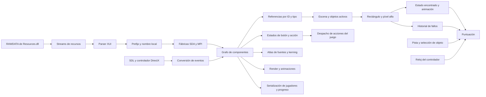
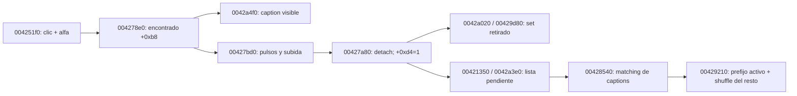

# Mystery P.I. — reconstrucción estática de SDA

Fecha: 2026-10-08. Estado: prototipo experimental de interacción con una escena;
compatibilidad de campaña y comparación con el original pendientes.

La instrucción vigente es dejar el original de lado. Este trabajo consume el
pseudocódigo ya exportado y los recursos como datos. Ghidra analiza el PE sin
lanzarlo. No se usa ratón/teclado del escritorio ni se cambia Huntsville.
Cuando una hipótesis requiera contraste nativo, se solicitará al usuario el acceso
al escritorio antes de ejecutar o manejar el original.

## Mapa de dependencias

Los nombres siguientes son roles asignados durante el análisis. Las direcciones
son VA del PE original con base 0x00400000. Los prototipos inferidos por Ghidra
no son un ABI confirmado.

Este diagrama expresa las relaciones revisadas. El JSON privado generado por
`tools/sda-prototype/map_dependencies.py` conserva las llamadas directas concretas,
sus direcciones y profundidad. La primera generación tiene 51 raíces revisadas,
1.607 nodos y 5.152 aristas directas, recorriendo tres niveles desde las raíces.
No es cierre de todas las llamadas indirectas del motor.

| Área | Funciones revisadas | Evidencia |
| --- | --- | --- |
| Recursos PE | 0048ffb0, 00490b40, 0048f9c0 | Registro del módulo y stream RAWDATA. |
| XUI | 00470f98, 004714d8, 00471549, 0048051b, 00480644 | Carga, callbacks de apertura/cierre y creación de nodos. |
| Fábricas | 0048c2a9, 00462050, 00464300 | Creación SDA, creación MPI y selección del loader por tipo. |
| Preparación de escena | 0040c6f0, 0040a720 | Carga del documento, registro de fábricas y enlace de componentes. |
| Acciones del juego | 00412300 | Despacho por valor de acción; contiene rutas de interfaz y juego. |
| Recorridos | 00480d13 | Máscara: traverse=1, update=2, render=4, events=8. |
| Botón | 004884f9, 00487cd7, 004882e9 | Hit-test rectangular, estados y render según el estado. |
| Objetos | 004251f0, 00473e0e, 004277e0, 004278e0 | Selección activa, lectura alfa, estado encontrado y cambio de jerarquía para animación. |
| Sets | 004657e0 | Resuelve referencias `objects` y nombres del set; puede contener varios objetos. |
| Actualización | 00425140 | Acumula el intervalo desde el último acierto y actualiza estado de pista. |
| Puntuación | 00452f10, 00453430, 00453830, 00453950, 004539c0 | Inicialización, objetos, fallos rápidos, pistas y coleccionables. |
| Fuente | 0048df06, 0048dff3 | Atlas, baseline, spacing, spacewidth, characterset y pares de kerning. |
| Guardado | 004061a0, 00408510 | Serialización de lista de jugadores y progreso; no se adopta aún su formato. |
| Entrada | 004905b0, 00492de0, 00492800, 004b71d0 | Wrapper del controlador, espera/conversión de evento y procedimiento Windows. |

La exportación completa previa contenía 5.906 funciones reconocidas. Dos objetivos
indirectos estaban etiquetados como código sin función y no aparecían en ella:
004b71d0 y 00462050. Se definieron explícitamente en el proyecto privado y se
exportaron con sus dependencias. El corte nuevo completó 600 decompilaciones.
Esto demuestra por qué ese conteo anterior no garantizaba cobertura del código.
El procedimiento Windows conserva advertencias de saltos indirectos sin recuperar.

`00474ab0` contiene nombres diagnósticos cuyos valores MPI no coinciden con los
constructores y loaders de este juego. No se usa ese switch para asignar tipos.
Por ejemplo, el constructor de eyespyarea establece 0x6d, el de eyespyimage 0x6f
y el de score 0x98; se corroboran con la fábrica y el loader reales.

## Eventos y reglas recuperadas

`00492800` traduce eventos a una estructura de 20 bytes. El botón procesa
movimiento tipo 3, pulsación tipo 4 y liberación tipo 5. Sus estados son normal=0,
hover=1, pulsado dentro=2, arrastre fuera=3 y deshabilitado=4. Una liberación dentro
tras pulsar dentro marca la acción; salir arrastrando evita ese acierto.

La escena de objetos comprueba el tipo 4 y el botón izquierdo. Recorre los sets
activos y sus objetos, ignora los ya encontrados, comprueba límites semiabiertos
y consulta el píxel de la textura. El ensamblador en 004254bf empuja el canal 3
antes de llamar a 00473e0e: se confirma alfa, y cualquier valor distinto de cero
cuenta. Un rectángulo opaco inventado produciría aciertos falsos en transparencias.

| Regla | Comportamiento observado estáticamente |
| --- | --- |
| Objeto | Suma 5.000 puntos. |
| Acierto rápido | Intervalo de actualización menor que 3,0 segundos. Primer bonus 2.500; los consecutivos aumentan 1.000 hasta 15.500. |
| Acierto lento | Suma sólo 5.000 y reinicia la cadena/bonus a 2.500. |
| Pista | Resta 7.500, con mínimo de puntuación cero. |
| Fallos rápidos | Las primeras cinco llamadas llenan el historial. La sexta desplaza el historial y comprueba la ventana de las últimas cinco marcas; si abarca como máximo 2.000 ms y la puerta permite penalizar, resta 2.500 y borra el historial. |
| Explicación de penalización | 004111d0 consulta un flag del jugador. La primera explicación puede impedir la resta; no se omite al reconstruir la campaña. |
| Coleccionable | Una ruta adicional suma 10.000; su contexto y tipos requieren continuar la revisión. |

Para el bonus de objetos, el ensamblador en 004257a1 compara el acumulador de la
escena +0x15c con el float 3,0 en 005075b8; pasa un booleano a 00453430 y después
reinicia el acumulador. No debe confundirse con 004532c0, que otorga 150/200 puntos
por otros aciertos y aparece en rutas de minijuegos.

Las cantidades y condiciones son evidencia estática, no resultados de una nueva
partida del original. Sigue pendiente validar animaciones, diálogo inicial de
penalización, selección aleatoria, pausa y guardado contra una hipótesis concreta.

## Prototipo y evidencia actual

`tools/sda-prototype/` contiene código experimental independiente. Lee Resources.dll
como un archivo PE; no ejecuta la DLL ni necesita lanzar el EXE. Carga la escena,
texturas y posiciones originales, mantiene el estado encontrado y procesa
aciertos/fallos usando alfa y las reglas de puntuación anteriores.

Se generó una imagen privada de la bóveda y otra tras tres aciertos. La prueba
headless utiliza píxeles alfa reales de los objetos seleccionados; obtuvo ganancias
de 5.000, 7.500 y 8.500 y un total de 21.000. Los artefactos y el registro están en
`private/mystery-pi-vegas/research/prototype/`. Se verificaron seis pruebas que cubren
límites alfa, cadena/cap del bonus, ventanas de fallo, puerta de penalización,
wrap del reloj de 32 bits, suelo de puntuación y parsing XUI.

La selección es explícita y admite sets de un objeto. La ventana interactiva está
preparada con `--interactive`, pero no se abrió durante este trabajo. Sus controles
son de investigación. No implementa todavía el menú original, selección de
campaña, sets compuestos, coleccionables, atlas/localización, animaciones, audio,
pausa, guardado ni victoria. La desaparición inmediata del sprite permite comprobar
la mutación, pero debe sustituirse por la animación nativa recuperada.

El siguiente trabajo es enlazar esas dependencias reales al prototipo y contrastar
hipótesis precisas con el original cuando el usuario ceda el escritorio. Android
se conecta después de comprobar el funcionamiento. Huntsville y su APK aprobada
permanecen separados de este experimento.

## Atlas originales, localización y primera vista del menú

La continuación se realizó con pseudocódigo y lectura estática de los PE, sin
abrir ni manejar el original. `tools/sda-prototype/fonts.py` añade una recuperación
independiente de texto a partir de los atlas originales. No cambia Director, el
perfil de Huntsville, Android ni la APK aprobada.

| Función | Evidencia recuperada |
| --- | --- |
| 0047e078 | Recorre columnas de toda la altura; considera tinta si algún alfa supera 4. Cierra el glifo en la primera columna vacía posterior. Límite de 256 entradas; no cierra automáticamente una franja que alcanza el borde derecho. |
| 0047d822 | Convierte charset UTF-8 a UTF-16 y registra índices; una aparición posterior de un carácter duplicado reemplaza su índice anterior. |
| 0047da4b | Avance entero por truncamiento de ancho × spacing float; espacio configurable. La altura viene del atlas. |
| 0047ddd4 | Dibuja el recorte original a toda su altura, sin escalarlo horizontalmente por spacing; modos verticales inferior, baseline, centro y superior. |
| 0048dff3 / 0047dbbd | Pares de kerning cargados con el primer byte UTF-8; búsqueda por los bytes bajos de los caracteres al dibujar. |
| 00472124 / 004725b0 | El ancho de alineación suma avances sin kerning; el dibujado sí añade kerning. El escape literal de nueva línea avanza tres cuartos de la altura. |
| 0048aad0 | Renderer virtual de label, slot 7 en vtable 0050896c: centra con ajuste de −1 píxel y traduce alineación del label a modos del texto. |
| 0048d003 / 004882e9 | Bounds del botón sin w/h explícitos se derivan de las texturas de sus estados. Caption centrado; offset local de caption corresponde al estado pulsado, mientras el global afecta al normal. |
| 0046ebf4 / 0046ed14 / 00471872 | Tabla de textos: clave desde la primera I hasta =, eliminación de whitespace final, valor entre primera/última comilla. Lookup de atributos @ID; si falta se conserva el atributo. |

El escape vertical presente en el botón principal usa dos dígitos. Se comprobó
su bloque x86 en 0047285f–004728a1: el acumulador también multiplica por el índice
del dígito, por lo que no se sustituye toda la rutina por un parser decimal general.
El prototipo admite avances de uno/dos dígitos y rechaza los más largos y otros
estilos hasta recuperar su comportamiento completo. Tampoco implementa el estado
global de color/alfa, clipping jerárquico ni todos los caminos de texto de SDA.

El sondeo de ENVS encontró 56 definiciones: 35 atlas presentes y 21 referencias a
recursos ausentes. No se crean sustitutos para esas referencias. De los presentes,
34 tienen igual número de franjas cerradas y unidades de charset; la excepción es
fnt_maplabelnumberlrg. Su lista omite el paréntesis de cierre, mientras el atlas
presenta 189 franjas. Se registra la discrepancia sin corregir la fuente de datos
ni afirmar equivalencia visual a partir de un conteo. STRINGS.TXT aportó 286 claves;
las etiquetas de objetos se resuelven además con la tabla de la escena.

Se generaron y revisaron visualmente los artefactos privados:

- `research/prototype/fonts/original-fonts.png`: tres fuentes y captions originales.
- `research/prototype/fonts/atlas-scan.json`: métricas, discrepancias, ausentes y hash del DLL.
- `research/prototype/menu-initial.png` y JSON: 11 elementos dibujados y siete botones con sus valores/rectángulos, obtenidos del XUI.

El menú es una vista estática con el padre activado para la prueba. Conserva los
flags originales de sus hijos y no inventa el nombre del jugador; siguen pendientes
el binding del jugador, logo/faders, navegación y estados de desbloqueo. No se
confunde esta imagen con una partida iniciada ni con una comparación contra el EXE.

La acción 299 del botón principal tiene rutas en 00412300 y 00414af0. La primera
depende de +0x410 y flags +0x5ee/+0x5ed, puede llamar 00406cc0 o mostrar un diálogo;
la segunda programa transición +0x4c4=0x26 mediante 00404950. Por eso aún no se
implementa como un salto directo inventado a la bóveda. El siguiente enlace exige
recuperar estas transiciones y la selección real de objetivos.

Pasaron 14 pruebas: las seis de escena/puntuación anteriores y ocho de atlas,
umbral, límite de entradas, charset duplicado, avance sin deformar píxeles,
centrado/kerning, alineación vertical, escapes y localización. Son fixtures propios;
la comparación diferencial con el original permanece pendiente de una hipótesis
concreta y del acceso al escritorio autorizado por el usuario.

## Selección nativa y sets compuestos

Se siguió la ruta de entrada de escena sin ejecutar el original. 0040f680 carga
la escena por 00405980/004157f0 y decide entre restauración del jugador o creación
de una lista nueva. En la ruta nueva aparecen 00423000 (historial), 00423680
(filtrado/colisiones) y 00421d90 → 00428d70 (tanda). Esto confirma que mezclar todos
los sets no sustituye el estado persistente ni la asignación de la campaña.

| Función | Dependencia recuperada |
| --- | --- |
| 004f0d25 / 004f0d32 | Semilla de 32 bits; estado = estado × 0x343fd + 0x269ec3, con wrap; salida = (estado >> 16) & 0x7fff. |
| 004291c0 | Reseed con timeGetTime y mezcla hacia delante: intercambio i con i + rand() % (count − i). |
| 00429210 | Coloca los sets activos al principio y mezcla el sufijo; no se implementa aún la restauración del prefijo. |
| 00428d70 | Oculta/desactiva la tanda anterior, mezcla sólo si cursor +0x8c es cero y elige hasta diez sets. Coloca filas desde y=121; acumula su altura. |
| 0042a040 | Sobrescribe el ancho del set con 146; confirmado con el push 0x92 en 0042a07b. |
| 004657e0 | Resuelve objetos y separa itemnamelist por comas; se comprobó ',' en 005193bc. |
| 0042a4f0 | Cuenta encontrados para elegir el siguiente caption del set. Los glifos se recuperan de los atlas propios de la escena. |
| 00428540 | Busca captions guardados entre los variantes de cada set, restaura una lista y reordena el resto. Su contexto de guardado sigue pendiente. |

`selection.py` reproduce RNG, mezcla y selección sobre un pool explícito. El
prototipo admite `--seed` o sets explícitos; una expresión con + selecciona los
componentes de un set compuesto. La ruta de clicks conserva el orden de sets y
objetos, comprueba alfa y puntúa cada componente encontrado. Cambia el caption
según el número encontrado, por ejemplo una lista de cuatro componentes pasa a
tres, dos y uno antes de desaparecer de la lista diagnóstica.

La comparación de wrap en 00428d70 es estricta: count < index, no count <= index.
El bloque x86 en 00428e68–00428e6a usa cmp y jle para mantener el índice cuando
ambos son iguales. 00476560 devuelve null fuera del rango semiabierto. Se añadió
un diagnóstico en ese límite, sin afirmar que el original necesariamente lo
alcanza durante una partida normal ni reemplazarlo por un modulo inventado. El
contexto de transición entre tandas requiere continuar el análisis.

La prueba privada con semilla 8 seleccionó diez sets de los 77 de la bóveda,
incluido un set de cuatro objetos. Se completaron trece aciertos con píxeles alfa
reales, captions decrecientes y 175.500 puntos; quedó vacía la lista diagnóstica.
Los artefactos son `vault-compound-initial.png`, `vault-compound-cleared.png` y
`compound-check.json` en research/prototype. Esta prueba no certifica victoria,
cambio de escena, animación nativa ni restauración de una partida del original.

Pasaron 20 pruebas en total. Las seis nuevas comprueban vectores conocidos de RNG,
wrap, dirección de mezcla, prefijo preservado, avance de tanda sin nuevo shuffle,
límite count==index, set compuesto, captions, score por componente y selección
inválida. El mapa de dependencias se regeneró con 78 raíces de roles, 1.673 nodos
y 5.432 aristas directas; sigue siendo un mapa de tres niveles, sin cierre de
llamadas indirectas. Se añadieron roles de transiciones, selección, captions,
atlas y localización. No se ejecutó el EXE ni se modificó Huntsville/Android.

## Ciclo de acierto, retirada y lista restaurada

Se recuperó una separación que el primer experimento no modelaba. 004277e0 lee
el flag encontrado +0xb8; 004277f0 lee el flag retirado +0xd4. Un clic establece
el primero mediante 004278e0 y mueve el objeto de su contenedor al área para la
animación. 00427bd0 establece el segundo tras retirar la imagen fuera de pantalla;
00427800 puede completar esa retirada directamente durante restauración.

Este diagrama describe dependencias revisadas, no cierre completo de callbacks.
La tabla activa guardada omite sets completamente retirados; para el resto usa el
caption correspondiente al número de componentes +0xd4, no al número de clicks.
Por ello un acierto todavía animándose puede cambiar la lista visible sin cambiar
aún el texto que aporta esta rutina al guardado. No se confunde esta lista con el
formato completo del archivo del jugador ni con una implementación de savestate.

`selection.TargetDeck.restore_batch` reproduce la búsqueda de captions de
00428540. Crea diez slots, busca cada texto entre las variantes de cada set y
elimina los slots sin matching. Si varios sets tienen el mismo texto, gana el
último visitado. 00429210 mueve los sets seleccionados al prefijo mediante búsqueda
e intercambio, luego reseed y shuffle sólo del sufijo. El cursor avanza diez,
aunque sobrevivan menos captions. Esta lógica se implementó independientemente;
no se restaura todavía una partida real porque los rectángulos del historial son
necesarios para determinar qué componentes de un set parcial deben retirarse.

La animación experimental sustituye la desaparición inmediata del primer
prototipo. Las constantes se leyeron estáticamente del PE: 005075f8=1,25;
005075fc≈0,04; 00507630≈0,20; 00507470=0,5; 00507560=−10. Constructor 00427630
inicializa la espera a ≈0,85. El update suma/resta escala por frame, hace dos
pulsos y resta tiempo a la espera; después acelera hacia arriba por frames hasta
salir por el borde superior. No se transforma la velocidad en píxeles/segundo
ni se presume que una actualización grande equivale a muchas pequeñas.

La revisión del ensamblador evitó normalizar un detalle del original: tras guardar
el rectángulo y empujar edi, 004279cd y 004279e1 cargan ambas veces [esp+0x24]
(altura). Los offsets guardados x/y están entonces en [esp+0x18]/[esp+0x1c]. El
centro horizontal inicial usa altura/2, pese a que el cálculo posterior de escala
usa el ancho de textura obtenido en 00427f85 por 00473b8c. Se conserva ese anclaje
peculiar; no se sustituyó por un centrado geométrico supuesto. La salida raster usa
Pillow bilinear y queda pendiente compararla con la transformación nativa de
00428080/0047406a, junto con cadence de render, clipping y alfa heredado.

La prueba privada generó 89 frames a pasos de 0,04 segundos del prototipo. El
objeto hizo dos pulsos, se retiró en el frame 88 y entonces cambió la lista para
guardado. El caption visible cambió desde el clic. Artefactos en research/prototype:
`vault-found-animation.gif`, `vault-found-pulse.png`, `vault-found-retired.png` y
`found-motion-check.json`. Son resultados del prototipo; no del EXE ni una nueva
comparación diferencial. Los inputs comerciales permanecen sin cambios.

Pasaron 27 pruebas: las 20 anteriores más dos de restauración de prefix/matching
y cinco de estados de animación, espera frente a pasos por frame, dos pulsos,
retirada, redondeo y separación entre caption visible/guardado. El mapa quedó en
89 raíces, 1.688 nodos y 5.486 aristas directas. Se añadieron roles de lifecycle e
historial; continúa limitado a tres niveles y llamadas directas.

Siguen pendientes las condiciones completas de filtrado de 00423000/00423680,
serialización original, transición de menú/escena, reloj de campaña y victoria.
El experimento no cambia Director, Huntsville ni Android y no abrió el original.

## Historial de componentes y filtrado al restaurar una escena

`history.py` y la API de Scene incorporan las rutas revisadas de 00424740,
00423000 y 00423680. La implementación utiliza registros en memoria obtenidos por
la prueba experimental; no sustituye el parser ni el serializer del jugador.

00424740 construye un label histórico cuyo texto es caption + ` (escena)` y,
cuando el contexto permite obtenerlo, espacio + `[variante]`. Se le asigna el
punto del clic como esquina superior izquierda, con dimensiones 100×10. Las
constantes se verificaron directamente: 005193c0 es espacio; 0051a208 es `[%d]`;
0051a210 es `[`. La variante viene de 0043c760 (+0x80 de su contexto), o cero en
la ruta cuyo flag consulta 00405b60; no se deduce del nombre del recurso.

00423680 toma el primer `[`, recorta el carácter previo y lee un entero con
sscanf; si no obtiene el contexto usa −1. Para cada set compara su caption actual
(según componentes retirados) más la escena contra la parte anterior del registro.
Las rutas implementadas conservan las siguientes condiciones:

- Misma variante y varios componentes pendientes: retira cada componente cuyo rectángulo contiene estrictamente el punto histórico; marca encontrado/retirado y lo oculta.
- Último componente pendiente: elimina el set; en un set simple puede ocultar su objeto sin probar el punto. En un compuesto usa el elemento cero como selección inicial y busca el primer pendiente que contiene el punto.
- Variante distinta: elimina el set sólo cuando ambas variantes son distintas de cero. Si alguna vale cero, conserva esa excepción.
- Al eliminar un hijo, el índice exterior sigue avanzando en esta pasada; el sucesor desplazado no se reevalúa. No se normaliza esa iteración ni se cambian sus límites geométricos.

El interior usado por esta rutina excluye los cuatro bordes. No es el hit-test
del clic normal, que admite los bordes izquierdo/superior antes de comprobar alfa.
La salida distingue objetos retirados por 00427800 de objetos sólo ocultados al
eliminar el set. Este replay no suma puntos ni reproduce el sonido de un acierto.
La comparación de renders y el contexto completo de registros reales siguen
pendientes; no se declara compatibilidad total con cualquier historial original.

00423000 se recuperó como limpieza de historia en la ruta de campaña nueva:
cuenta cuántos sets tienen alguna variante de caption como substring de registros
que contienen ` (escena)` y no contienen el literal `[0]`. Si quedan menos de diez
sets sin afectar, elimina esos registros del historial, conservando `[0]` y otras
escenas. No se compara sólo el número de objetos retirados ni se sustituye el
substring por igualdad exacta. Con diez sets sin afectar conserva el historial.
La API exige solicitar esa ruta mediante `prune_previous_history`; no la aplica
al restaurar una lista guardada. La decisión real de ruta pertenece al contexto
revisado en 0040f680, que aún debe enlazarse al flujo del menú.

La prueba privada de la bóveda encontró un componente de un set de cuatro,
esperó su retirada y reconstruyó una nueva instancia desde el historial y caption
pendiente. Recuperó el mismo set, retiró exactamente ese componente y conservó
los otros tres como objetivos; volver a clicar el punto anterior ya no da acierto.
El renderer produjo `vault-history-restored.png`; `history-replay-check.json`
registra los textos/puntos, variante explícita, hash del DLL y límites. Sólo son
observaciones del prototipo: no se leyó un save original ni se restauró score,
reloj, jugador o campaña. No se abrió ni controló el EXE.

Pasaron 36 pruebas. Las nueve nuevas comprueban el formato del registro,
interior estricto, scope/variantes, retiro parcial, eliminación del último set,
iteración tras borrar hijos, umbral de limpieza, matching por substrings y replay
integrado con lista activa/click siguiente. Siguen pendientes la serialización
original, reloj, selección del jugador y las transiciones de campaña/victoria.

## Objetivo ampliado: tandas jugables y progreso persistente

El usuario añadió poder iniciar una partida, completar una tanda, pasar a la
siguiente y conservar el progreso. Se incorporó ese flujo al prototipo de escenas,
sin dar por terminada la navegación original ni reemplazar el alcance del objetivo.

Scene.next_batch exige que todos los componentes activos hayan terminado su
retirada. Avanza mediante el deck recuperado y conserva score, acumuladores de
tiempo y objetos encontrados. El botón experimental `Siguiente tanda` usa ese
contrato. Los checks de límite estricto de 00428d70 permanecen; están pendientes
las transiciones y renovación de pool de la campaña que contextualizan ese límite.

`progress.py` serializa el estado del prototipo como `case-recomp-sda-prototype/1`:
sets activos, candidatos, orden/cursor del deck, score y cadena, historial de
fallos, elapsed/since_found, registros históricos, flags de visibilidad y toda la
animación experimental de cada objeto. Se conserva la distinción de encontrado y
retirado. El snapshot copia sus listas/estados para que avanzar luego no modifique
la captura. La carga verifica schema, huella de Resources.dll y referencias/estados
contra la escena original antes de devolver una instancia recuperada.

El archivo se escribe mediante temporal + reemplazo atómico dentro de
`local-output/sda-prototype/`. La ventana guarda tras clicks, pistas, avance de
tanda, cada cinco segundos y al cerrar; dispone de botón manual y opción --resume.
El tiempo offline no se añade. Es persistencia explícita del prototipo, no el
formato de save original ni un savestate del EXE. No modifica archivos del jugador,
Director, Huntsville o la APK aprobada. El renderer del menú original continúa
como vista estática y sus rutas de jugador/mapa/diálogos deben enlazarse.

La prueba con Resources.dll de la bóveda completó los 13 componentes de la primera
tanda de diez sets, esperó la retirada, avanzó a otra tanda sin repetir sus sets y
conservó 175.500 puntos. Guardó el estado, cargó otra instancia con los mismos
recursos y verificó igualdad del snapshot, incluido cursor=20. Tras cargar encontró
un objeto de la segunda tanda: sumó 5.000 y pasó a 180.500. Los registros privados
son `session-progress-check.json`, `vault-second-batch-resumed.png` y los JSON de
progreso en local-output/sda-prototype. Se probó también --resume desde el CLI.

Se ejecutaron los callbacks reales de Tk de siguiente tanda, guardar y cerrar
con el root withdrawn. La ventana no se mostró y no se usaron mouse, teclado ni
el original. `gui-progress-check.json` registra cursor=20, score=175.500 y cierre
con guardado. Esta verificación comprueba el flujo de controles del prototipo;
no es una prueba manual del juego original ni de su menú.

Pasaron 38 pruebas: las 36 anteriores más el recorrido de dos tandas con round
trip de archivo y recuperación durante una animación, con rechazo de recursos
distintos y tiempo no finito. El mapa actual tiene 92 raíces, 1.688 nodos y 5.486
aristas directas. La persistencia del primer recorrido queda demostrada en el
prototipo; el objetivo completo sigue abierto por inicio/navegación original,
reloj de nivel, contexto de campaña/victoria y comparación diferencial pendiente.
